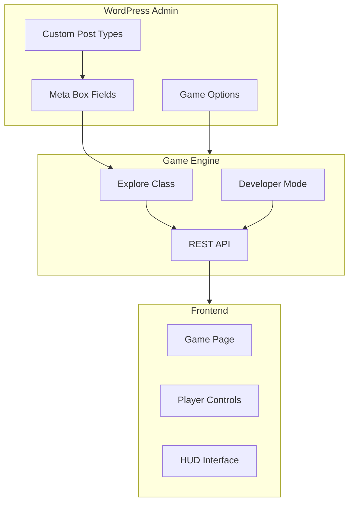

# Orbem Studio Documentation

Welcome to the Orbem Studio documentation. This guide will help you build fully interactive, story-driven RPG games directly inside WordPress.

## What is Orbem Studio?

Orbem Studio is a WordPress plugin that transforms WordPress into a complete, browser-based game engine. It provides structured systems for creating narrative RPGs, educational experiences, and interactive storytelling without requiring external game engines or complicated integrations.

The plugin manages all game content as WordPress custom post types with powerful metadata systems, delivering gameplay through a REST API-driven frontend architecture with optional Developer Mode for rapid iteration.

## Architecture Overview

## Requirements

- **WordPress:** 6.1 or higher
- **PHP:** 8.1 or higher
- **Node.js:** 22.4.0 or higher (for development)
- **npm:** 10.5.0 or higher (for development)

## Quick Start

1. [Install and configure Orbem Studio](getting-started.md#installation)
2. [Set up your first game area](getting-started.md#creating-your-first-area)
3. [Create your main character](getting-started.md#creating-your-first-character)
4. [Configure global game options](global-options.md)
5. [Enable Developer Mode for visual editing](developer-mode.md)

## Documentation Structure

### Getting Started

- **[Getting Started Guide](getting-started.md)** - Installation, setup wizard, and building your first game

### Game Objects Reference

Complete reference documentation for all game object types:

- **[Game Objects Overview](game-objects/README.md)** - Understanding the game object system
- **[Areas](game-objects/areas.md)** - Levels, maps, and navigation
- **[Characters](game-objects/characters.md)** - Playable characters, NPCs, and crew mates
- **[Enemies](game-objects/enemies.md)** - Enemy types, AI behaviors, and boss fights
- **[Weapons](game-objects/weapons.md)** - Combat system and weapon configuration
- **[Missions](game-objects/missions.md)** - Quest system, triggers, and rewards
- **[Cutscenes](game-objects/cutscenes.md)** - Storytelling and cinematics
- **[Items and Triggers](game-objects/items-and-triggers.md)** - Collectibles, signs, explainers, walls, and minigames

### Configuration and Tools

- **[Global Options](global-options.md)** - Configure HUD, styling, integrations, and game settings
- **[Developer Mode](developer-mode.md)** - In-game visual editing and rapid iteration tools

### API Reference

Complete REST API documentation for custom integrations:

- **[API Overview](api/README.md)** - Understanding the REST API architecture
- **[Gameplay Endpoints](api/gameplay-endpoints.md)** - Player-facing endpoints for game state
- **[Developer Mode Endpoints](api/devmode-endpoints.md)** - Admin-only endpoints for in-game editing

### Extending Orbem Studio

Documentation for developers who want to customize or extend the plugin:

- **[Extensibility Overview](extending/README.md)** - How to extend Orbem Studio
- **[Hooks and Filters](extending/hooks-and-filters.md)** - Complete WordPress hooks reference
- **[Custom Integrations](extending/custom-integrations.md)** - Building custom frontends and integrations

## Core Concepts

### Custom Post Types

Orbem Studio registers 13 custom post types to manage game content:

- `explore-area` - Game levels and maps
- `explore-character` - Playable characters and NPCs
- `explore-enemy` - Enemies and boss fights
- `explore-weapon` - Weapons and combat items
- `explore-mission` - Quests and objectives
- `explore-cutscene` - Story sequences
- `explore-point` - Collectible items
- `explore-sign` - Focus view items
- `explore-explainer` - Popup explanations
- `explore-wall` - Collision boundaries
- `explore-minigame` - Interactive minigames
- `explore-magic` - Abilities and powers
- `explore-communicate` - Communication devices

### Metadata-Driven Design

All game objects use WordPress post meta for configuration. This provides flexibility, extensibility, and familiar WordPress editing interfaces for content creators.

### REST API Architecture

The game engine communicates with WordPress through a secure REST API at `/wp-json/orbemorder/v1/`. This architecture provides:

- Clean separation between content and presentation
- Permission-aware endpoints for secure gameplay
- Easy integration with custom frontends
- Performance optimization through targeted data fetching

### Developer Mode

Administrator users can enable Developer Mode to access in-game editing tools:

- Visual object positioning with drag-and-drop
- Trigger overlay visualization
- Wall builder for collision boundaries
- In-game object creation
- Real-time updates without page reloads

## Support and Community

- **Plugin Homepage:** [https://orbem.studio/](https://orbem.studio/)
- **Author:** [Orbem Order](https://orbemorder.com/)
- **Support:** [Patreon](https://www.patreon.com/c/OrbemOrder)
- **Version:** 1.0.2

## License

Orbem Studio is licensed under GPL v2 or later. You are free to use, modify, and distribute this plugin according to the terms of the GNU General Public License.

---

**Ready to start building?** Head over to the [Getting Started Guide](getting-started.md) to begin creating your game.
