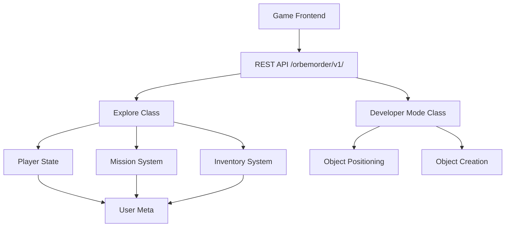

# REST API Overview

Orbem Studio exposes a REST API for game state management, player interactions, and developer tools. All endpoints are namespaced under `/wp-json/orbemorder/v1/`.

## Table of Contents

- [API Architecture](#api-architecture)
- [Authentication](#authentication)
- [Endpoint Categories](#endpoint-categories)
- [Response Format](#response-format)
- [Error Handling](#error-handling)

## API Architecture



### Design Principles

**REST-Based:** Standard WordPress REST API infrastructure  
**Stateless:** Each request is self-contained  
**Permission-Aware:** Endpoints check user capabilities  
**JSON Communication:** All data exchanged as JSON  

## Authentication

### For Gameplay Endpoints

Most gameplay endpoints require authentication with the `read` capability (standard WordPress user).

**Authentication Methods:**
- WordPress session cookies (browser-based)
- WordPress REST API nonce
- Application passwords (for external integrations)

**Nonce Usage:**
```javascript
// Nonce is provided in localized script data
const response = await fetch('/wp-json/orbemorder/v1/area/', {
  method: 'POST',
  headers: {
    'X-WP-Nonce': OrbemOrder.orbemNonce,
    'Content-Type': 'application/json'
  },
  body: JSON.stringify({area: 'level-1'})
});
```

### For Developer Mode Endpoints

Developer Mode endpoints require the `manage_options` capability (Administrator role).

## Endpoint Categories

### Gameplay Endpoints

17 endpoints for player-facing game functionality:

- Player state management
- Area data retrieval
- Inventory management
- Mission progression
- Character recruitment
- Enemy interactions

See [Gameplay Endpoints](gameplay-endpoints.md) for complete documentation.

### Developer Mode Endpoints

4 endpoints for admin-only in-game editing:

- Object positioning
- Object resizing
- Dynamic field generation
- Object creation

See [Developer Mode Endpoints](devmode-endpoints.md) for complete documentation.

## Response Format

### Success Response

```json
{
  "success": true,
  "data": {
    // Response data varies by endpoint
  }
}
```

### Error Response

```json
{
  "success": false,
  "data": "Error message describing what went wrong"
}
```

### Common Response Patterns

**Simple Success:**
```json
{
  "success": true,
  "data": "success"
}
```

**Data Return:**
```json
{
  "success": true,
  "data": {
    "posts": [...],
    "meta": {...}
  }
}
```

**Error:**
```json
{
  "success": false,
  "data": "User not authenticated"
}
```

## Error Handling

### Common Error Responses

**Authentication Failure:**
```json
{
  "success": false,
  "data": "User not authenticated"
}
```

**Permission Denied:**
```json
{
  "success": false,
  "data": "Insufficient permissions"
}
```

**Invalid Data:**
```json
{
  "success": false,
  "data": "Invalid data point"
}
```

**Missing Object:**
```json
{
  "success": false,
  "data": "Invalid item ID"
}
```

### HTTP Status Codes

The API uses standard WordPress REST API status codes:

- `200 OK` - Successful request
- `400 Bad Request` - Invalid parameters
- `401 Unauthorized` - Authentication required
- `403 Forbidden` - Insufficient permissions
- `404 Not Found` - Endpoint doesn't exist
- `500 Internal Server Error` - Server-side error

## Making API Requests

### From Frontend JavaScript

```javascript
// Example: Save player coordinates
async function savePosition(area, top, left) {
  const response = await fetch('/wp-json/orbemorder/v1/coordinates/', {
    method: 'POST',
    headers: {
      'X-WP-Nonce': OrbemOrder.orbemNonce,
      'Content-Type': 'application/json'
    },
    body: JSON.stringify({
      area: area,
      top: top,
      left: left
    })
  });
  
  const result = await response.json();
  return result;
}
```

### From External Applications

```bash
# Using WordPress Application Password
curl -X POST \
  -H "Authorization: Basic $(echo -n 'username:application_password' | base64)" \
  -H "Content-Type: application/json" \
  -d '{"area":"level-1"}' \
  https://yoursite.com/wp-json/orbemorder/v1/area/
```

## Rate Limiting

WordPress does not implement rate limiting by default. Consider implementing rate limiting if exposing the API publicly.

## API Versioning

Current version: `v1`

The API is namespaced at `/orbemorder/v1/` to allow future versioning without breaking existing integrations.

## Security Considerations

**Nonce Verification:**
- All state-changing requests verify WordPress nonces
- Nonces expire after 24 hours by default

**Capability Checks:**
- Each endpoint verifies user permissions
- Developer Mode endpoints restricted to administrators

**Input Sanitization:**
- All user input is sanitized before processing
- Post IDs validated before database access

**Meta Key Restrictions:**
- Only approved meta keys can be modified
- Keys must start with `explore-` prefix

## Next Steps

- **[Gameplay Endpoints](gameplay-endpoints.md)** - Complete reference for player-facing endpoints
- **[Developer Mode Endpoints](devmode-endpoints.md)** - Complete reference for admin endpoints
- **[Custom Integrations](../extending/custom-integrations.md)** - Building with the API
