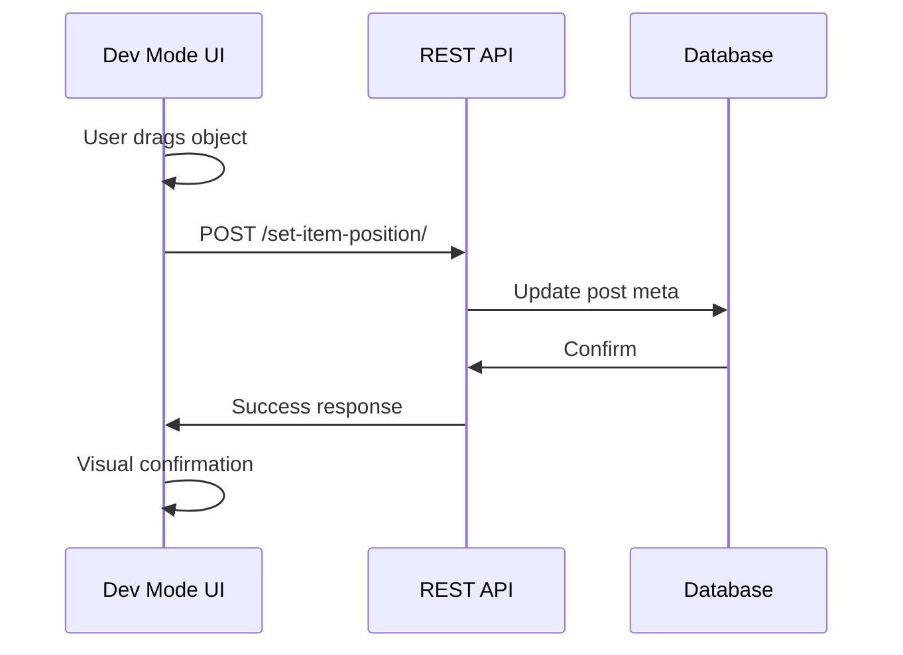
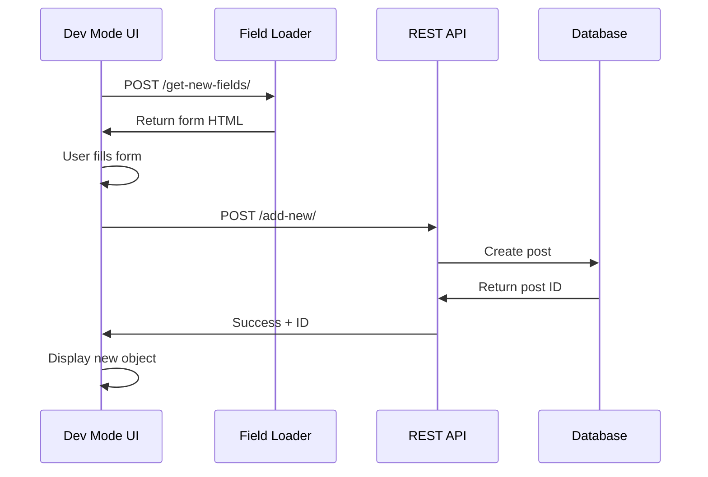

# Developer Mode Endpoints

Admin-only REST API endpoints for in-game visual editing and object management.

## Base URL

All endpoints are under: `/wp-json/orbemorder/v1/`

## Authentication

All Developer Mode endpoints require `manage_options` capability (Administrator role).

---

## Object Positioning

### POST `/set-item-position/`

Update object position coordinates.

**Method:** `POST`  
**Permission:** Administrator

**Request:**
```json
{
  "id": 123,              // Post ID
  "top": 2500,            // Y coordinate
  "left": 3000,           // X coordinate
  "meta": "",             // Optional: meta key for trigger positioning
  "walkingPath": "false"  // "true" for path recording
}
```

**Response:**
```json
{
  "success": true,
  "data": "success"
}
```

**Use Cases:**
- Drag-drop object positioning
- Trigger zone repositioning
- Walking path recording

**Path Recording:**
When `walkingPath` is set to `"true"`, coordinates are added to the object's `explore-path` meta array instead of replacing position.

---

## Object Sizing

### POST `/set-item-size/`

Update object dimensions.

**Method:** `POST`  
**Permission:** Administrator

**Request:**
```json
{
  "id": 123,      // Post ID
  "height": 100,  // Height in pixels
  "width": 80,    // Width in pixels
  "meta": ""      // Optional: meta key for trigger sizing
}
```

**Response:**
```json
{
  "success": true,
  "data": "success"
}
```

**Use Cases:**
- Resize objects visually
- Adjust trigger zones
- Fine-tune collision boxes

---

## Dynamic Field Loading

### POST `/get-new-fields/`

Retrieve configuration fields for a post type.

**Method:** `POST`  
**Permission:** Administrator

**Request:**
```json
{
  "type": "explore-character"
}
```

**Response:**
```json
{
  "success": true,
  "data": "<form fields HTML>"
}
```

**Returns:** HTML form fields for the specified post type's meta box.

**Use Cases:**
- Load forms dynamically in Developer Mode UI
- Display appropriate fields when creating objects in-game
- Support for all 13 custom post types

**Supported Types:**
- `explore-area`
- `explore-character`
- `explore-enemy`
- `explore-weapon`
- `explore-mission`
- `explore-cutscene`
- `explore-point`
- `explore-sign`
- `explore-explainer`
- `explore-wall`
- `explore-minigame`
- `explore-magic`
- `explore-communicate`

---

## Object Creation

### POST `/add-new/`

Create a new game object from Developer Mode.

**Method:** `POST`  
**Permission:** Administrator

**Request:**
```json
{
  "type": "explore-character",
  "area": "level-1",
  "values": {
    "title": "New NPC",
    "featured-image": "https://...",
    "explore-top": 2500,
    "explore-left": 3000,
    "explore-height": 100,
    "explore-width": 80,
    // ... other meta fields
  }
}
```

**Response:**
```json
{
  "success": true,
  "data": 456  // New post ID
}
```

**Validation:**
- Verifies post type starts with `explore-`
- Validates meta keys against allowed list
- Sanitizes all input values
- Requires `title` in values
- Auto-assigns to specified area

**Created Post:**
- Status: `publish`
- Type: As specified
- Meta: All provided values
- Area: Auto-assigned from request or user's current location

---

## Security Considerations

### Permission Checks

All endpoints verify `manage_options` capability:

```php
$permission_callback = function () {
    return current_user_can('manage_options');
};
```

### Meta Key Validation

Only meta keys starting with `explore-` can be modified:

```php
if (!str_starts_with($meta, 'explore-')) {
    return error_response('Invalid meta key');
}
```

### Post Type Validation

Only `explore-*` post types can be created:

```php
if (!str_starts_with($post_type, 'explore-')) {
    return error_response('Invalid post type');
}
```

### Post Access

Endpoints verify user can edit the specified post:

```php
if (!current_user_can('edit_post', $post_id)) {
    return error_response('Invalid item ID');
}
```

## Usage in Developer Mode

### Position Update Flow



### Object Creation Flow



## Error Responses

### Common Errors

**Not Authenticated:**
```json
{
  "success": false,
  "data": "User not authenticated"
}
```

**Invalid Post Type:**
```json
{
  "success": false,
  "data": "Invalid post type"
}
```

**Invalid Meta Key:**
```json
{
  "success": false,
  "data": "Invalid meta key"
}
```

**Invalid Post ID:**
```json
{
  "success": false,
  "data": "Invalid item ID"
}
```

**Missing Data:**
```json
{
  "success": false,
  "data": "Invalid data point"
}
```

**Post Creation Failed:**
```json
{
  "success": false,
  "data": "Post creation failed."
}
```

## Example Usage

### Update Object Position

```javascript
async function updatePosition(postId, top, left) {
  const response = await fetch('/wp-json/orbemorder/v1/set-item-position/', {
    method: 'POST',
    headers: {
      'X-WP-Nonce': OrbemOrder.orbemNonce,
      'Content-Type': 'application/json'
    },
    body: JSON.stringify({
      id: postId,
      top: top,
      left: left
    })
  });
  
  return await response.json();
}
```

### Create New Character

```javascript
async function createCharacter(characterData) {
  const response = await fetch('/wp-json/orbemorder/v1/add-new/', {
    method: 'POST',
    headers: {
      'X-WP-Nonce': OrbemOrder.orbemNonce,
      'Content-Type': 'application/json'
    },
    body: JSON.stringify({
      type: 'explore-character',
      area: 'current-area',
      values: characterData
    })
  });
  
  return await response.json();
}
```

## Related Documentation

- **[API Overview](README.md)** - Architecture and authentication
- **[Gameplay Endpoints](gameplay-endpoints.md)** - Player-facing endpoints
- **[Developer Mode](../developer-mode.md)** - Using Developer Mode features
