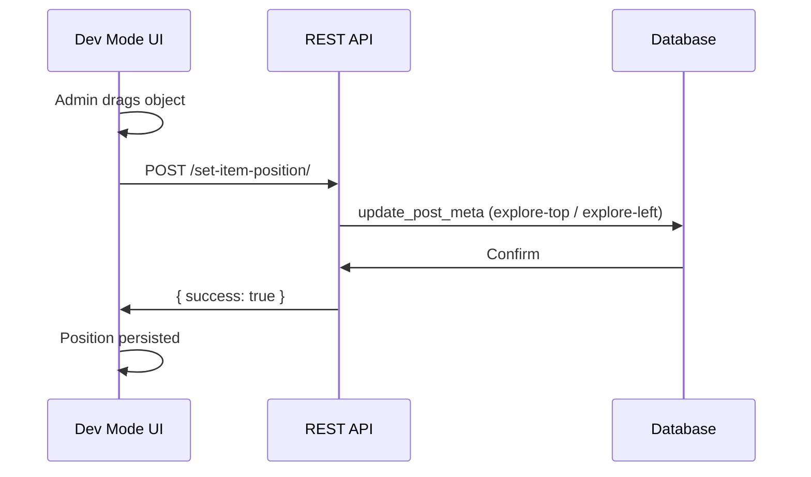
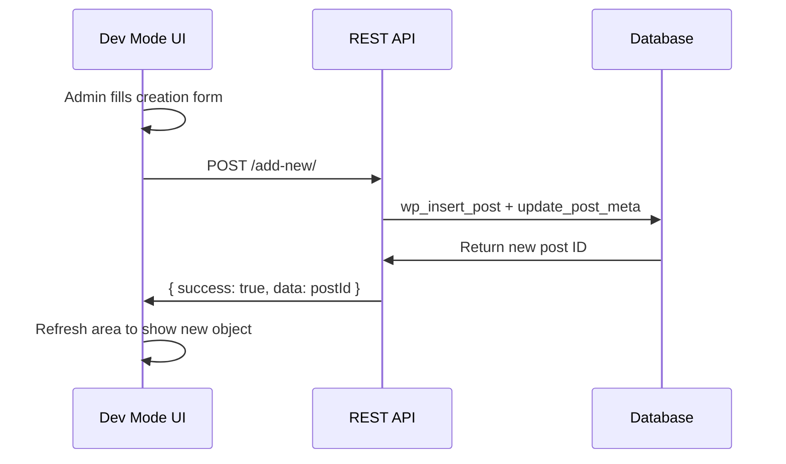

# Developer Mode Endpoints

Admin-only REST API endpoints for in-game visual editing and object management.

## Base URL

All endpoints are under: `/wp-json/orbemorder/v1/`

## Authentication

All Developer Mode endpoints require the `manage_options` capability (Administrator role). Requests that fail this check receive a WordPress `403 Forbidden` response.

---

## Object Positioning

### POST `/set-item-position/`

Update an object's position on the map, a trigger's coordinates, or append a waypoint to a walking path. This is called automatically when you drag an object in Developer Mode.

**Method:** `POST`
**Permission:** Administrator (`manage_options`)

**Request:**
```json
{
  "id": 123,
  "top": 2500,
  "left": 3000,
  "height": 100,
  "width": 80,
  "meta": "",
  "walkingPath": "false"
}
```

| Parameter | Type | Description |
|-----------|------|-------------|
| `id` | int | Post ID of the game object to update |
| `top` | int | New Y coordinate (pixels from top of map) |
| `left` | int | New X coordinate (pixels from left of map) |
| `height` | int | Height of the trigger/object (used when `meta` is set) |
| `width` | int | Width of the trigger/object (used when `meta` is set) |
| `meta` | string | Optional. If provided, updates a nested trigger meta key (e.g., `explore-cutscene-trigger`). Must start with `explore-`. |
| `walkingPath` | string | `"true"` to append this coordinate as a new waypoint to the object's `explore-path` array instead of replacing the position. |

**Behavior:**
- If `meta` is provided and is not `"true"`, the `top`, `left`, `height`, and `width` values are merged into the existing meta array for that key.
- If `walkingPath` is `"true"`, the coordinate is appended to `explore-path` meta.
- Otherwise, `explore-top` and `explore-left` post meta are updated directly.

**Response:**
```json
{
  "success": true,
  "data": "success"
}
```

---

## Object Creation

### POST `/add-new/`

Create a new game object of any `explore-*` post type from within Developer Mode, without leaving the game page.

**Method:** `POST`
**Permission:** Administrator (`manage_options`)

**Request:**
```json
{
  "type": "explore-character",
  "area": "level-1",
  "values": {
    "title": "New NPC",
    "featured-image": "https://yoursite.com/wp-content/uploads/sprite.png",
    "explore-top": 2500,
    "explore-left": 3000,
    "explore-height": 100,
    "explore-width": 80
  }
}
```

| Parameter | Type | Description |
|-----------|------|-------------|
| `type` | string | Post type to create. Must start with `explore-`. |
| `area` | string | Area slug to assign the object to. Falls back to the user's `current_location` user meta if omitted. |
| `values` | object | Key/value pairs for the new object. `title` is required. `featured-image` sets the featured image. All other keys must be valid meta keys for the post type. |

**Validation:**
- `type` must begin with `explore-`
- `values` must be a non-empty object and include a `title`
- Meta keys are checked against the allowed list from `Meta_Box::getMetaData()` — only recognised keys are saved
- `featured-image` must be an existing attachment URL; it is converted to an attachment ID and set as the featured image

**Response:**
```json
{
  "success": true,
  "data": 456
}
```

`data` is the new post ID.

---

## Security Notes

### Permission Check

Both endpoints verify `manage_options` before processing:

```php
$permission_callback = function () {
    return current_user_can('manage_options');
};
```

### Meta Key Validation (`/set-item-position/`)

When `meta` is provided, the key must begin with `explore-`:

```php
if (!str_starts_with($meta, 'explore-')) {
    return error_response('Invalid meta key');
}
```

### Post Ownership (`/set-item-position/`)

The endpoint additionally verifies that the current user can edit the specified post:

```php
if (!current_user_can('edit_post', $item)) {
    return error_response('Invalid item ID');
}
```

### Post Type Validation (`/add-new/`)

Only `explore-*` post types may be created:

```php
if (!str_starts_with($post_type, 'explore-')) {
    return error_response('Invalid data point');
}
```

---

## Usage in Developer Mode

### Drag-and-Drop Position Update


```mermaid
sequenceDiagram
    participant UI as Dev Mode UI
    participant API as REST API
    participant DB as Database

    UI->>UI: Admin drags object
    UI->>API: POST /set-item-position/
    API->>DB: update_post_meta (explore-top / explore-left)
    DB->>API: Confirm
    API->>UI: { success: true }
    UI->>UI: Position persisted
```

### In-Game Object Creation


```mermaid
sequenceDiagram
    participant UI as Dev Mode UI
    participant API as REST API
    participant DB as Database

    UI->>UI: Admin fills creation form
    UI->>API: POST /add-new/
    API->>DB: wp_insert_post + update_post_meta
    DB->>API: Return new post ID
    API->>UI: { success: true, data: postId }
    UI->>UI: Refresh area to show new object
```

---

## JavaScript Examples

### Update Object Position

```javascript
async function updatePosition(postId, top, left) {
  const response = await fetch('/wp-json/orbemorder/v1/set-item-position/', {
    method: 'POST',
    headers: {
      'X-WP-Nonce': OrbemOrder.orbemNonce,
      'Content-Type': 'application/json'
    },
    body: JSON.stringify({ id: postId, top, left })
  });

  return await response.json();
}
```

### Append Walking Path Waypoint

```javascript
async function addWaypoint(postId, top, left) {
  const response = await fetch('/wp-json/orbemorder/v1/set-item-position/', {
    method: 'POST',
    headers: {
      'X-WP-Nonce': OrbemOrder.orbemNonce,
      'Content-Type': 'application/json'
    },
    body: JSON.stringify({ id: postId, top, left, walkingPath: 'true' })
  });

  return await response.json();
}
```

### Create New Character

```javascript
async function createCharacter(characterData) {
  const response = await fetch('/wp-json/orbemorder/v1/add-new/', {
    method: 'POST',
    headers: {
      'X-WP-Nonce': OrbemOrder.orbemNonce,
      'Content-Type': 'application/json'
    },
    body: JSON.stringify({
      type: 'explore-character',
      area: 'current-area',
      values: characterData
    })
  });

  return await response.json();
}
```

---

## Error Responses

```json
{ "success": false, "data": "User not authenticated" }
{ "success": false, "data": "Invalid item ID" }
{ "success": false, "data": "Invalid meta key" }
{ "success": false, "data": "Invalid data point" }
{ "success": false, "data": "Post creation failed." }
```

## Related Documentation

- **[API Overview](README.md)** - Architecture and authentication
- **[Gameplay Endpoints](gameplay-endpoints.md)** - Player-facing endpoints
- **[Developer Mode](../developer-mode.md)** - Using Developer Mode features
