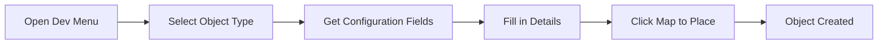

# Developer Mode

Developer Mode is an admin-only feature that provides in-game visual editing tools for rapid iteration and precise object positioning.

## Table of Contents

- [Overview](#overview)
- [Enabling Developer Mode](#enabling-developer-mode)
- [Developer Mode Interface](#developer-mode-interface)
- [Visual Object Positioning](#visual-object-positioning)
- [Trigger Visualization](#trigger-visualization)
- [Wall Builder](#wall-builder)
- [Best Practices](#best-practices)

## Overview

Developer Mode activates when an administrator user plays the game, adding powerful visual editing capabilities directly within the game interface.

### Key Features

- Drag-and-drop object positioning
- Visual trigger overlays
- Real-time coordinate updates
- Wall builder for collision boundaries
- Pin-point coordinate display tool
- God / No touch modes for main character
- In-game object creation (Pro feature)
- Instant updates without page reloads

### Access Requirements

- User must have `manage_options` capability (Administrator role)
- Automatically activates when admin users visit the game page

## Enabling Developer Mode

Developer Mode is automatically available to administrators. To access it:

1. Log in as an administrator
2. Navigate to your game page (configured in Global Options)
3. Item/Character/Trigger click and drag works automatically
4. Additional Developer tools appear when "DEVMODE" link in bottom right corner of the interface is clicked

**Note:** Regular players and non-admin users never see Developer Mode tools.

## Developer Mode Interface

When active, you'll see additional UI elements:

### DEVMODE Toggle

A "DEVMODE" button appears in the bottom-right corner:
- Click to open the Developer Mode menu
- Access all developer tools from this menu

### Visual Indicators

- **Trigger Overlays**: Semi-transparent colored boxes show trigger zones
- **Coordinate Display**: Pin-point tool allows for instant coordinate display on click map point

## Visual Object Positioning

### Dragging Objects

1. Enable Developer Mode (if object/trigger is transparent)
2. Click and hold any game object (character, enemy, item, weapon)
3. Drag to new position
4. Release to save new coordinates

**Behind the Scenes:**
- Position updates via REST API (`/set-item-position/`)
- New coordinates saved to post meta immediately
- Changes persist without page reload

### Trigger Positioning

Triggers (cutscene triggers, mission triggers, etc.) can be positioned visually:

1. Triggers appear as colored overlay boxes
2. Click and drag to reposition

## Trigger Visualization

Developer Mode shows all trigger zones as colored overlays:

### Trigger Types

**Cutscene Triggers:**
- Visual indicator shows trigger zone

**Mission Triggers:**
- Shows completion trigger zones
- Indicates blockade areas

**Item Triggers:**
- Materialization triggers
- Interaction zones

### Using Trigger Overlays

1. Open Developer Mode menu
2. Enable trigger visualization
3. All triggers appear as colored boxes
4. Drag as needed

## Wall Builder

The wall builder creates invisible collision boundaries directly in-game.

### Accessing Wall Builder

1. Open Developer Mode menu
2. Select "Wall Builder" Icon
3. Wall creation is now enabled as icon glows

### Creating Walls

1. Click starting position on map
2. Drag to define wall dimensions
3. Release to create wall
4. Wall automatically saves as `explore-wall` post

### Wall Configuration

- **Width/Height**: Set via dragging
- **Position**: Set via placement
- **Area**: Automatically assigned to current area

### Editing Walls

1. Existing walls appear as blue overlay boxes in Developer Mode
2. Click to select
3. Drag to reposition

### Best Practices

- Align walls with visual boundaries on your map
- Test player movement after placing walls
- Use multiple smaller walls rather than one large complex shape
- Leave clear pathways for player navigation
- Use walls on items in part of the map image instead of defining stationary item posts

## Creating Objects In-Game (Pro feature)

Developer Mode allows creating new game objects without leaving the game.

### New Addition Menu

1. Open Developer Mode menu
2. Select "New Addition"
3. Choose object type from dropdown
4. Fill in configuration fields
5. Submit and page will refresh
6. Continue game to see your new object

### Supported Object Types

- Characters
- Enemies
- Weapons
- Items
- Focus view items
- Explainers
- Walls
- Cutscenes

### Workflow

### Creating the Object

1. Fill in required fields (title, images, etc.)
2. Use pin-point tool to get top/left coordinates
3. REST endpoint: `/add-new/`
4. Object appears immediately in-game upon refresh

## Best Practices

### Positioning Workflow

**Rough Placement First:**
1. Create objects in WordPress admin with approximate coordinates
2. Use Developer Mode for fine-tuning
3. Test gameplay flow
4. Adjust as needed

**Precision Positioning:**
- Use Developer Mode's drag-and-drop for exact placement
- Verify coordinates update in real-time
- Test from player perspective

### Trigger Configuration

**Sizing:**
- Make triggers slightly larger than visual elements
- Ensure triggers are easily activatable
- Test trigger activation from multiple angles

**Placement:**
- Position triggers where players expect interaction
- Align with visual cues (doors, NPCs, items)
- Avoid overlapping triggers when possible

### Testing

**Disable Dev Mode for Testing:**
- Log out or use incognito mode with non-admin account
- Verify triggers work as expected
- Check that dev UI doesn't appear

**Iterate Quickly:**
- Make changes in Developer Mode
- Test immediately
- No need to return to WordPress admin

### Performance

**Use Sparingly During Active Play:**
- Developer Mode adds overhead
- Best used during development, not production
- Regular players never see the performance impact

## Developer Mode API Endpoints

Developer Mode uses dedicated REST endpoints:

### Set Item Position

**Endpoint:** `POST /wp-json/orbemorder/v1/set-item-position/`

Updates object coordinates.

**Parameters:**
- `id` - Post ID
- `top` - Y coordinate
- `left` - X coordinate
- `meta` - Meta key (for trigger positioning)

### Set Item Size (Pro feature)

**Endpoint:** `POST /wp-json/orbemorder/v1/set-item-size/`

Updates object dimensions.

**Parameters:**
- `id` - Post ID
- `height` - Object height
- `width` - Object width
- `meta` - Meta key (for trigger sizing)

### Get New Fields (Pro feature)

**Endpoint:** `POST /wp-json/orbemorder/v1/get-new-fields/`

Retrieves configuration fields for object type.

**Parameters:**
- `type` - Post type (e.g., `explore-character`)

**Returns:** HTML form fields for that object type

### Add New (Pro feature)

**Endpoint:** `POST /wp-json/orbemorder/v1/add-new/`

Creates a new game object.

**Parameters:**
- `type` - Post type
- `area` - Area slug
- `values` - Object configuration data

**Returns:** New post ID

See [Developer Mode Endpoints](api/devmode-endpoints.md) for complete API documentation.

## Troubleshooting

**Developer Mode Not Appearing:**
- Verify you're logged in as Administrator
- Check that you have `manage_options` capability
- Clear browser cache

**Objects Not Draggable:**
- Ensure Developer Mode menu is open
- Check that objects are properly loaded
- Verify no JavaScript errors in console

**Position Updates Not Saving:**
- Check browser console for API errors
- Verify WordPress REST API is accessible
- Confirm user permissions

**Trigger Overlays Not Showing:**
- Enable trigger visualization in Dev Mode menu
- Verify triggers have height/width values > 0
- Check that triggers belong to current area

## Related Documentation

- **[Game Objects Overview](game-objects/README.md)** - Understanding object types
- **[Developer Mode API](api/devmode-endpoints.md)** - API endpoint reference
- **[Global Options](global-options.md)** - Game configuration
