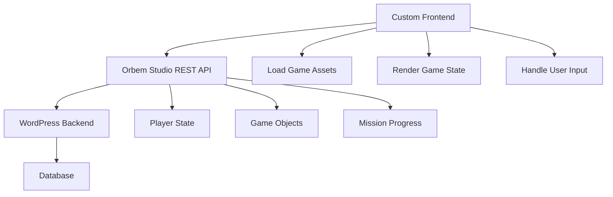

# Custom Integrations

Build custom frontends, external tools, and third-party integrations using the Orbem Studio REST API.

## Table of Contents

- [Overview](#overview)
- [Authentication](#authentication)
- [Building a Custom Frontend](#building-a-custom-frontend)
- [Mobile Client Integration](#mobile-client-integration)
- [External Admin Tools](#external-admin-tools)
- [Analytics Integration](#analytics-integration)
- [Best Practices](#best-practices)

## Overview

Orbem Studio's REST API enables building custom interfaces and integrations beyond the default WordPress frontend.

### Use Cases

- **Mobile Apps:** Native iOS/Android game clients
- **Alternative Frontends:** React, Vue, or Angular SPAs
- **Admin Dashboards:** Custom game management interfaces
- **Analytics Tools:** Player behavior tracking and reporting
- **Third-Party Integrations:** Discord bots, Twitch extensions, etc.

## Authentication

### WordPress Application Passwords

For external applications, use WordPress Application Passwords (WP 5.6+).

**Setup:**
1. Navigate to Users → Profile
2. Scroll to "Application Passwords"
3. Create new password for your application
4. Store securely (shown only once)

**Usage:**
```bash
curl -X POST \
  -u "username:application_password" \
  -H "Content-Type: application/json" \
  -d '{"area":"level-1"}' \
  https://yoursite.com/wp-json/orbemorder/v1/area/
```

### OAuth Integration

For user-facing applications, implement OAuth flow:

1. Use WordPress OAuth plugin
2. Implement authorization flow
3. Store access tokens securely
4. Refresh tokens as needed

## Building a Custom Frontend

### Architecture



### Initial Data Loading

**1. Load Area Data:**
```javascript
async function loadArea(areaSlug) {
  const response = await fetch('/wp-json/orbemorder/v1/area/', {
    method: 'POST',
    headers: {
      'Authorization': 'Basic ' + btoa('username:app_password'),
      'Content-Type': 'application/json'
    },
    body: JSON.stringify({ area: areaSlug })
  });
  
  const result = await response.json();
  return result.data;
}
```

**2. Parse Game Objects:**
```javascript
function parseGameObjects(areaData) {
  const characters = areaData.posts.filter(p => p.post_type === 'explore-character');
  const enemies = areaData.posts.filter(p => p.post_type === 'explore-enemy');
  const items = areaData.posts.filter(p => p.post_type === 'explore-point');
  
  return { characters, enemies, items };
}
```

**3. Render Game State:**
```javascript
function renderGame(areaData) {
  const canvas = document.getElementById('game-canvas');
  const ctx = canvas.getContext('2d');
  
  // Load and draw map
  const map = new Image();
  map.src = areaData.meta['explore-map'];
  map.onload = () => {
    ctx.drawImage(map, 0, 0);
    
    // Render game objects
    renderObjects(ctx, areaData.posts);
  };
}
```

### Player State Management

**Save Player Position:**
```javascript
async function savePosition(area, top, left) {
  await fetch('/wp-json/orbemorder/v1/coordinates/', {
    method: 'POST',
    headers: {
      'Authorization': 'Basic ' + credentials,
      'Content-Type': 'application/json'
    },
    body: JSON.stringify({ area, top, left })
  });
}
```

**Update Player Stats:**
```javascript
async function updateStat(type, value, add = true) {
  await fetch('/wp-json/orbemorder/v1/add-explore-points/', {
    method: 'POST',
    headers: {
      'Authorization': 'Basic ' + credentials,
      'Content-Type': 'application/json'
    },
    body: JSON.stringify({ type, value, add })
  });
}
```

### Mission System Integration

**Complete Mission:**
```javascript
async function completeMission(missionSlug) {
  const response = await fetch('/wp-json/orbemorder/v1/mission/', {
    method: 'POST',
    headers: {
      'Authorization': 'Basic ' + credentials,
      'Content-Type': 'application/json'
    },
    body: JSON.stringify({ mission: missionSlug })
  });
  
  return response.json();
}
```

## Mobile Client Integration

### React Native Example

```javascript
import AsyncStorage from '@react-native-async-storage/async-storage';

class OrbemGameClient {
  constructor(baseUrl, username, appPassword) {
    this.baseUrl = baseUrl;
    this.credentials = btoa(`${username}:${appPassword}`);
  }
  
  async loadArea(areaSlug) {
    try {
      const response = await fetch(`${this.baseUrl}/wp-json/orbemorder/v1/area/`, {
        method: 'POST',
        headers: {
          'Authorization': `Basic ${this.credentials}`,
          'Content-Type': 'application/json'
        },
        body: JSON.stringify({ area: areaSlug })
      });
      
      const result = await response.json();
      
      // Cache for offline access
      await AsyncStorage.setItem(`area_${areaSlug}`, JSON.stringify(result.data));
      
      return result.data;
    } catch (error) {
      // Load from cache if offline
      const cached = await AsyncStorage.getItem(`area_${areaSlug}`);
      return cached ? JSON.parse(cached) : null;
    }
  }
  
  async saveProgress(data) {
    // Queue for sync when online
    const queue = await AsyncStorage.getItem('sync_queue') || '[]';
    const updates = JSON.parse(queue);
    updates.push(data);
    await AsyncStorage.setItem('sync_queue', JSON.stringify(updates));
  }
}
```

### Unity Integration

```csharp
using UnityEngine;
using UnityEngine.Networking;
using System.Collections;

public class OrbemAPIClient : MonoBehaviour
{
    private string baseUrl = "https://yoursite.com";
    private string credentials; // Base64 encoded "username:password"
    
    public IEnumerator LoadArea(string areaSlug)
    {
        string url = $"{baseUrl}/wp-json/orbemorder/v1/area/";
        string jsonData = $"{{\"area\":\"{areaSlug}\"}}";
        
        using (UnityWebRequest request = UnityWebRequest.Post(url, jsonData))
        {
            request.SetRequestHeader("Authorization", $"Basic {credentials}");
            request.SetRequestHeader("Content-Type", "application/json");
            
            yield return request.SendWebRequest();
            
            if (request.result == UnityWebRequest.Result.Success)
            {
                string responseText = request.downloadHandler.text;
                // Parse and use data
                ProcessAreaData(responseText);
            }
        }
    }
}
```

## External Admin Tools

### Game Dashboard Example

```javascript
// React admin dashboard component
import React, { useState, useEffect } from 'react';

function GameDashboard({ apiUrl, credentials }) {
  const [areas, setAreas] = useState([]);
  const [characters, setCharacters] = useState([]);
  
  useEffect(() => {
    loadGameData();
  }, []);
  
  async function loadGameData() {
    // Load all areas
    const areasResponse = await fetch(`${apiUrl}/wp/v2/explore-area?per_page=100`, {
      headers: { 'Authorization': `Basic ${credentials}` }
    });
    setAreas(await areasResponse.json());
    
    // Load all characters
    const charsResponse = await fetch(`${apiUrl}/wp/v2/explore-character?per_page=100`, {
      headers: { 'Authorization': `Basic ${credentials}` }
    });
    setCharacters(await charsResponse.json());
  }
  
  return (
    <div className="dashboard">
      <h2>Game Statistics</h2>
      <div className="stats">
        <StatCard title="Total Areas" value={areas.length} />
        <StatCard title="Total Characters" value={characters.length} />
      </div>
      <AreaList areas={areas} />
      <CharacterList characters={characters} />
    </div>
  );
}
```

## Analytics Integration

### Tracking Player Behavior

```javascript
class GameAnalytics {
  constructor(apiUrl, credentials) {
    this.api = apiUrl;
    this.auth = credentials;
  }
  
  async trackEvent(eventType, eventData) {
    // Send to your analytics service
    await fetch('https://analytics.yourservice.com/event', {
      method: 'POST',
      headers: { 'Content-Type': 'application/json' },
      body: JSON.stringify({
        event: eventType,
        data: eventData,
        timestamp: new Date().toISOString()
      })
    });
  }
  
  async trackAreaVisit(area) {
    await this.trackEvent('area_visit', { area });
  }
  
  async trackMissionComplete(mission) {
    await this.trackEvent('mission_complete', { mission });
  }
  
  async trackCombatEncounter(enemy, outcome) {
    await this.trackEvent('combat', { enemy, outcome });
  }
}

// Usage
const analytics = new GameAnalytics(apiUrl, credentials);
analytics.trackAreaVisit('level-1');
```

## Best Practices

### Performance

**Caching:**
- Cache area data locally
- Implement aggressive caching for static assets
- Use service workers for offline support

**Batch Requests:**
```javascript
// Instead of multiple individual requests
const updates = [
  savePosition(area, top, left),
  updateStat('health', 25, true),
  completeMission('mission-1')
];

await Promise.all(updates);
```

### Error Handling

```javascript
async function apiRequest(endpoint, data) {
  try {
    const response = await fetch(endpoint, {
      method: 'POST',
      headers: {
        'Authorization': credentials,
        'Content-Type': 'application/json'
      },
      body: JSON.stringify(data)
    });
    
    if (!response.ok) {
      throw new Error(`HTTP ${response.status}`);
    }
    
    const result = await response.json();
    
    if (!result.success) {
      throw new Error(result.data);
    }
    
    return result.data;
  } catch (error) {
    console.error('API request failed:', error);
    // Implement retry logic or queue for later
    return null;
  }
}
```

### Security

**Secure Credentials:**
- Never expose credentials in client-side code
- Use environment variables
- Implement OAuth for user-facing apps
- Rotate application passwords regularly

**Input Validation:**
- Validate all data before sending to API
- Sanitize user input
- Implement rate limiting

**HTTPS Only:**
- Always use HTTPS for API requests
- Validate SSL certificates
- Don't accept self-signed certificates in production

## Testing Integrations

### Test Environment

```javascript
const TEST_CONFIG = {
  baseUrl: 'https://test.yoursite.com',
  credentials: btoa('test_user:test_password')
};

describe('Orbem API Integration', () => {
  test('should load area data', async () => {
    const data = await loadArea('test-area');
    expect(data).toHaveProperty('posts');
    expect(data).toHaveProperty('meta');
  });
  
  test('should save player position', async () => {
    const result = await savePosition('test-area', 100, 200);
    expect(result.success).toBe(true);
  });
});
```

## Related Documentation

- **[API Overview](../api/README.md)** - REST API architecture
- **[Gameplay Endpoints](../api/gameplay-endpoints.md)** - Available endpoints
- **[Extensibility Overview](README.md)** - Other extension methods
- **[Hooks and Filters](hooks-and-filters.md)** - WordPress hooks
