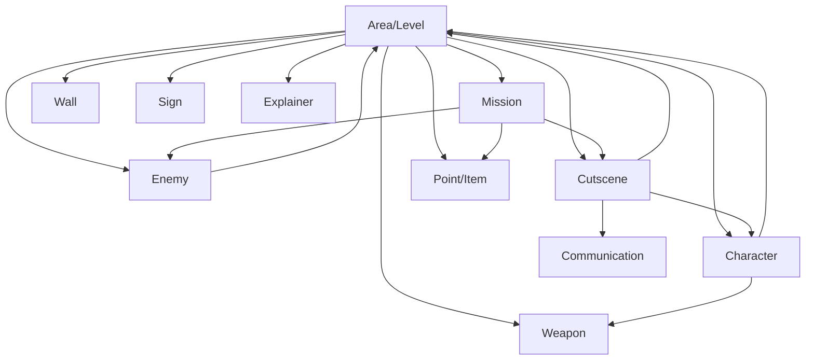

# Game Objects Overview

Orbem Studio manages all game content through 13 custom post types, each representing a different type of game object. Understanding how these objects work together is essential for building your game world.

## Table of Contents

- [Object Types](#object-types)
- [Object Relationships](#object-relationships)
- [Common Patterns](#common-patterns)
- [Metadata System](#metadata-system)
- [Working with Game Objects](#working-with-game-objects)

## Object Types

All game objects in Orbem Studio are managed as WordPress custom post types with specialized metadata fields. Here's what each object type does:

### Core World Objects

**[Areas](areas.md)** (`explore-area`)
- Game levels, maps, and playable zones
- Define the physical space where gameplay occurs
- Control background images, music, and navigation between levels

**[Characters](characters.md)** (`explore-character`)
- Playable characters (controlled by the player)
- Non-playable characters (NPCs with pre-defined behaviors)
- Support for crew mates (switchable playable characters)

**[Enemies](enemies.md)** (`explore-enemy`)
- Hostile entities that challenge the player
- Four types: blockers, shooters, runners, and bosses
- Include AI behaviors like wandering and path following

**[Weapons](weapons.md)** (`explore-weapon`)
- Combat items with attack values
- Can be melee or projectile-based
- Collectible or assigned as starting equipment

**[Walls](items-and-triggers.md#walls)** (`explore-wall`)
- Invisible collision boundaries
- Prevent character movement through certain areas
- Used to create obstacles and define walkable space

### Quest and Story Objects

**[Missions](missions.md)** (`explore-mission`)
- Player objectives and quests
- Support branching mission chains
- Provide rewards and unlock new content

**[Cutscenes](cutscenes.md)** (`explore-cutscene`)
- Scripted story sequences
- Support dialogue, character movement, and transitions
- Can be triggered automatically or by player interaction

**[Communication Items](items-and-triggers.md#communication-items)** (`explore-communicate`)
- Messages delivered to player's communication device
- Triggered by cutscenes or game events
- Support text-to-speech narration

### Interactive Objects

**[Points/Items](items-and-triggers.md#collectible-items)** (`explore-point`)
- Collectible items scattered throughout areas
- Can be rewards, hazards, or interactive triggers
- Support materialization (appearing after conditions are met)

**[Signs/Focus View Items](items-and-triggers.md#signs-and-focus-view)** (`explore-sign`)
- Objects the player can examine closely
- Display detailed images and descriptions
- Good for readable documents, artwork, or clues

**[Explainers](items-and-triggers.md#explainer-popups)** (`explore-explainer`)
- Popup explanations and tutorials
- Can point to specific screen locations
- Support text-to-speech narration

**[Minigames](items-and-triggers.md#minigames)** (`explore-minigame`)
- Interactive game-within-game experiences
- Custom content and rules
- Can provide rewards upon completion

**[Magic/Abilities](items-and-triggers.md#magic-and-abilities)** (`explore-magic`)
- Special powers unlocked by the player
- Tied to character progression and leveling
- Currently supports "transportation" ability

## Object Relationships

Understanding how game objects relate to each other helps you design cohesive game experiences.



### Key Relationships

**Area is Central**
- Almost all objects belong to an area
- Areas define where objects appear in the game world
- Multiple objects can exist in the same area

**Missions Drive Progression**
- Missions can trigger cutscenes upon completion
- Missions can require interaction with specific items
- Missions can defeat specific enemies
- Completing missions can unlock new areas or remove obstacles

**Cutscenes Tell Stories**
- Cutscenes interact with characters (NPCs and playable)
- Cutscenes can transport players to different areas
- Cutscenes can trigger after mission completion
- Cutscenes can send messages to communication devices

**Characters Use Weapons**
- Playable characters have default weapons
- Characters can collect new weapons during gameplay
- Each weapon has unique images for each character

## Common Patterns

### Object Materialization

Many object types support "materialization" - appearing after certain conditions are met. This is configured through three meta fields:

- `explore-materialize-item-trigger` - Define a trigger area that reveals this object
- `explore-materialize-after-cutscene` - Reveal after a specific cutscene completes
- `explore-materialize-after-mission` - Reveal after a specific mission completes

**Example use case:** A weapon appears in an area only after the player completes a quest.

### Object Removal

Some objects can be removed from the game world after conditions are met:

- `explore-remove-after-cutscene` - Remove after a specific cutscene completes

**Example use case:** An NPC disappears after a story cutscene where they leave the area.

### Trigger-Based Interactions

Most interactive objects use trigger zones - rectangular areas that activate when the player enters:

```
Top: 1500      (Y coordinate)
Left: 2000     (X coordinate)
Height: 100    (Vertical size)
Width: 150     (Horizontal size)
```

**Trigger Types:**
- **Auto triggers** - Activate immediately when player enters the zone
- **Engagement triggers** - Require player to press the action key while in the zone

### Area Transitions

Areas can link to each other through transition triggers:

1. Create an "Area" object representing the destination
2. Configure the source area's transition trigger
3. Set destination coordinates in the target area

**Example:** A door in "Level 1" that transports to "Level 2".

## Metadata System

All game objects use WordPress post meta to store configuration. This provides several benefits:

### Structured Data

Each object type has a specific set of meta fields defined in the plugin code. This ensures consistency and prevents misconfiguration.

### Familiar Interface

Content creators use the WordPress post editor they already know. The Configuration meta box appears below the main content area for all game object types.

### Extensibility

Developers can use WordPress hooks to add custom meta fields or modify existing ones. See the [Hooks and Filters](../extending/hooks-and-filters.md) documentation for details.

### Type-Specific Fields

Different object types show different configuration options:

- **Areas** show map upload and music fields
- **Characters** show directional sprite uploads and ability selection
- **Enemies** show health, damage, and AI behavior options
- **Weapons** show attack values and projectile settings

## Working with Game Objects

### Creating Objects

1. Navigate to the object type in the WordPress admin (e.g., **Orbem Studio** → **Characters**)
2. Click **Add New**
3. Set a title (this becomes the object's identifier)
4. Configure meta fields in the Configuration box
5. Click **Publish**

### Organizing Objects

**Use Descriptive Titles**
- Good: "Level 1 - Starting Village"
- Bad: "Area 1"

**Leverage Taxonomies**
- The `explore-area-point` taxonomy lets you group objects by area
- Use this to filter and organize your content

**Post Slugs Matter**
- The post slug is used as the identifier in the game engine
- Keep slugs short and lowercase (e.g., "hero", "level-1", "sword")

### Testing Objects

After creating objects:

1. Visit your game page to see them in action
2. Use [Developer Mode](../developer-mode.md) to visually position objects
3. Check browser console for errors if objects don't appear

### Deleting Objects

Before deleting game objects:

1. **Check references** - See if other objects reference this one (e.g., missions that trigger this cutscene)
2. **Update dependencies** - Remove references from other objects
3. **Test thoroughly** - Ensure the game still works after deletion

**Warning:** Deleting objects referenced by others may cause game errors. Always check dependencies first.

## Next Steps

Now that you understand the game object system, dive into the specific object types:

- **[Areas](areas.md)** - Build your game world
- **[Characters](characters.md)** - Create playable and non-playable characters
- **[Enemies](enemies.md)** - Add challenge with hostile entities
- **[Weapons](weapons.md)** - Design your combat system
- **[Missions](missions.md)** - Create objectives and progression
- **[Cutscenes](cutscenes.md)** - Tell your story
- **[Items and Triggers](items-and-triggers.md)** - Add interactivity and collectibles

Or explore related topics:

- **[Developer Mode](../developer-mode.md)** - Visual object positioning
- **[Global Options](../global-options.md)** - Game-wide configuration
- **[REST API](../api/README.md)** - Understanding the data layer
