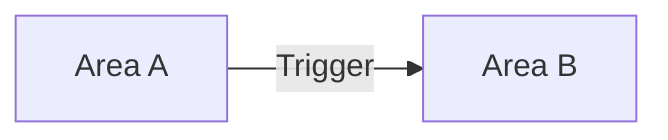
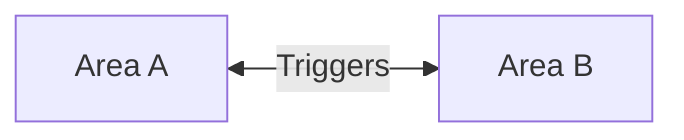
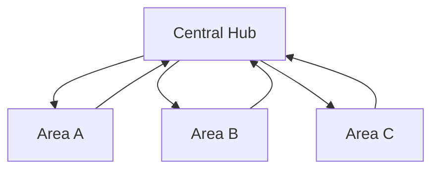
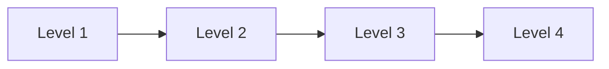

# Areas

Areas (also called levels or maps) are the playable spaces where your game takes place. Each area has its own background image, music, objects, and connections to other areas.

## Table of Contents

- [Overview](#overview)
- [Creating an Area](#creating-an-area)
- [Configuration Fields](#configuration-fields)
- [Area Transitions](#area-transitions)
- [Area Cutscenes](#area-cutscenes)
- [Best Practices](#best-practices)
- [Examples](#examples)

## Overview

**Post Type:** `explore-area`

Areas serve as containers for all other game objects. When you create characters, enemies, items, or any interactive elements, you assign them to specific areas where they'll appear during gameplay.

### Key Features

- Background images that define the playable space
- Background music for atmosphere
- Starting positions for player characters
- Transition triggers to connect areas
- Optional cutscene mode for non-interactive story scenes
- Communication device assignment for area-specific messaging

### Common Use Cases

- **Game levels** - Sequential areas that represent stages or chapters
- **Open world zones** - Interconnected areas for exploration
- **Interior spaces** - Buildings, caves, or rooms with distinct atmospheres
- **Story scenes** - Non-interactive cutscene backgrounds

## Creating an Area

1. Navigate to **Orbem Studio** → **Areas** in your WordPress admin
2. Click **Add New**
3. Enter a descriptive title (e.g., "Level 1 - Forest Path" or "Village Square")
4. Configure the meta fields in the Configuration box
5. Click **Publish**

The post title becomes the area's display name, while the slug is used as its identifier in the game engine.

## Configuration Fields

### Map Image

**Field:** `explore-map`  
**Type:** Upload  
**Required:** Yes

The background image that serves as the playable area. Your character walks on this image.

**Specifications:**
- **Recommended minimum size:** 5000px × 4517px
- **Format:** PNG or JPG
- **Aspect ratio:** Flexible, but wider/taller images provide more exploration space

**Tips:**
- Larger images allow for more exploration but may impact load times
- Optimize images for web (compress without significant quality loss)
- Use consistent style across all area images for visual coherence
- Consider how the starting position will appear on screen

**Example:**
```
File: forest-map.png
Dimensions: 6000px × 5000px
File size: ~2MB (optimized)
```

### Background Music

**Field:** `explore-music`  
**Type:** Upload  
**Required:** No

Audio file that loops continuously while the player is in this area.

**Specifications:**
- **Format:** MP3, WAV, or OGG
- **Recommended length:** 1-3 minutes (will loop)
- **Volume:** Pre-normalize to consistent levels across all tracks

**Tips:**
- Choose music that matches the area's mood and theme
- Consider fade-in/fade-out transitions at loop points
- Test volume levels against sound effects
- Music can be muted in cutscenes if needed

### Starting Position

**Fields:** `explore-start-top`, `explore-start-left`, `explore-start-direction`

Define where the player character appears when entering this area.

#### Top Coordinate

**Field:** `explore-start-top`  
**Type:** Number  
**Unit:** Pixels from top edge

Vertical position where the character spawns.

**Example:** `2000` (2000 pixels from the top of the map image)

#### Left Coordinate

**Field:** `explore-start-left`  
**Type:** Number  
**Unit:** Pixels from left edge

Horizontal position where the character spawns.

**Example:** `2500` (2500 pixels from the left of the map image)

#### Starting Direction

**Field:** `explore-start-direction`  
**Type:** Select  
**Options:** `up`, `down`, `left`, `right`

Which direction the character faces when appearing in this area.

**Example:** `down` (character faces downward/toward screen)

**Tips:**
- Position characters away from area edges to avoid immediate boundary collisions
- Face characters toward the center of the playable space
- Consider what the player should see first (points of interest)
- Test starting positions in [Developer Mode](../developer-mode.md) for quick adjustment

### Area Transition Trigger

**Fields:** `explore-area`, `explore-top`, `explore-left`, `explore-height`, `explore-width`

Create a zone that transports the player to another area when touched.

#### Destination Area

**Field:** `explore-area`  
**Type:** Select (list of all areas)

Which area the player will be sent to when touching this trigger.

**Example:** Select "Level 2 - Mountain Pass" from the dropdown

#### Trigger Position

**Fields:**
- `explore-top` - Top coordinate of the trigger zone
- `explore-left` - Left coordinate of the trigger zone
- `explore-height` - Height of the trigger zone
- `explore-width` - Width of the trigger zone

**Example trigger at a door:**
```
Top: 1500
Left: 3200
Height: 150
Width: 100
```

**Tips:**
- Place triggers where visual doorways, paths, or exits appear on the map
- Make triggers slightly larger than visual elements to ensure activation
- Test trigger placement to ensure smooth transitions
- Use [Developer Mode](../developer-mode.md) to visualize trigger zones

### Is Cutscene Mode

**Field:** `explore-is-cutscene`  
**Type:** Radio (`yes` or `no`)  
**Default:** `no`

Convert this area into a non-interactive cutscene background.

**When set to "yes":**
- Player cannot move in this area
- Area serves as a static background for story scenes
- Requires complimentary cutscene for dialogue

**Use Cases:**
- Story flashbacks that don't require movement
- Static conversation backgrounds
- Title screens or ending screens
- Cinematic story moments

**Example:**
```
Area: "Throne Room Cutscene"
Is Cutscene: yes
(Use with cutscene objects for dialogue)
```

### Communication Device

**Field:** `explore-communicate-type`  
**Type:** Select (taxonomy)

Assign a communication device type to this area. When communication items are sent to the player while in this area, they'll appear in this device.

**Use Cases:**
- Different devices for different locations (e.g., "Radio" for outdoor, "Computer" for base)
- Thematic communication methods
- Area-specific messaging systems

**Example:**
```
Area: "Spaceship Bridge"
Communication Device: "Ship Console"
```

See [Communication Items](items-and-triggers.md#communication-items) for more details.

## Area Transitions

Areas can be connected to create a seamless game world. There are several ways to handle transitions:

### Simple Transition

Create a trigger in Area A that sends the player to Area B:



**Configuration:**
1. Edit Area A
2. Set `explore-area` to "Area B"
3. Configure trigger position and size
4. Player starts at Area B's `explore-start-top` and `explore-start-left`

### Two-Way Transition

Create triggers in both areas for back-and-forth travel:



**Configuration:**
1. In Area A: Create trigger pointing to Area B
2. In Area B: Create trigger pointing to Area A
3. Position triggers where visual exits appear

### Hub-and-Spoke World

One central area connects to multiple sub-areas:



**Example:** A village square with paths to forest, cave, and mountains.

### Linear Progression

Areas connect in sequence:



**Note:** Players can only move forward, not backward (unless you add return triggers).

### Conditional Transitions

Use [missions](missions.md) to block area transitions until objectives are complete. Place mission blockades on area transition triggers.

## Area Cutscenes

When `explore-is-cutscene` is set to "yes", the area becomes a static background for story sequences.

### How It Works

1. Area displays the map image but disables player movement
2. Cutscene objects in this area can display dialogue
3. Cutscene can transition player to a different playable area after completion

### Configuration

```
Title: Flashback - Ancient Temple
Map Image: temple-interior.jpg
Is Cutscene: yes
```

### Usage with Cutscene Objects

Create a cutscene object assigned to this area:

```
Cutscene: "Temple Memory"
Area: "Flashback - Ancient Temple"
Next Area: "Present Day - Village" (where to send player after)
```

See [Cutscenes](cutscenes.md) for full cutscene configuration.

## Best Practices

### Map Image Design

**Visual Clarity**
- Use distinct colors and textures to differentiate walkable vs. non-walkable areas
- Add visual cues for exits, doorways, and points of interest
- Consider top-down perspective for consistent character placement

**Performance**
- Compress images without visible quality loss
- Use progressive JPEGs for faster perceived loading
- Consider creating smaller versions for mobile if needed

**Consistency**
- Maintain the same art style across all areas
- Use consistent lighting direction
- Match color palettes within themed regions

### Music Selection

**Atmosphere**
- Match music to area theme (peaceful village, tense dungeon, etc.)
- Use silence strategically in suspenseful areas
- Consider dynamic music that changes with gameplay (requires custom implementation)

**Technical**
- Loop points should be seamless
- Normalize volume across all tracks
- Provide mute option in game settings

### Starting Positions

**Player Orientation**
- Position characters facing interesting or important elements
- Avoid starting in corners or awkward positions
- Place near area transitions if coming from another area

**Safety**
- Start away from enemies or hazards
- Ensure enough space for player to orient themselves
- Test starting position with different screen sizes

### Area Organization

**Naming Conventions**
- Use clear, descriptive names: "Level 1 - Forest Path"
- Include zone type in name: "Interior - Castle Hall"
- Add sequence numbers for linear progression

**Content Planning**
- Plan area connections before creating transition triggers
- Document area relationships in a world map diagram
- Consider player progression and difficulty curve

## Examples

### Example 1: Starting Village

```
Title: Level 1 - Peaceful Village
Slug: starting-village

Map Image: village-main.jpg (5500 × 5000px)
Music: peaceful-town.mp3
Starting Top: 2500
Starting Left: 2750
Starting Direction: down

Area Transition:
  Destination: forest-path
  Top: 800
  Left: 2700
  Height: 150
  Width: 200

Is Cutscene: no
```

**Description:** Player starts in village center, can explore, and exit north to forest.

### Example 2: Multi-Exit Hub

```
Title: Central Plaza
Slug: central-plaza

Map Image: plaza.jpg (6000 × 6000px)
Music: marketplace-ambient.mp3
Starting Top: 3000
Starting Left: 3000
Starting Direction: down

Area Transitions:
  1. North Exit → mountain-pass (Top: 500, Left: 2900, Height: 150, Width: 200)
  2. East Exit → shopping-district (Top: 2900, Left: 5500, Height: 200, Width: 150)
  3. South Exit → residential (Top: 5500, Left: 2900, Height: 150, Width: 200)

Is Cutscene: no
```

**Description:** Central hub with three exits leading to different zones.

### Example 3: Story Cutscene Area

```
Title: Flashback - Betrayal Scene
Slug: flashback-betrayal

Map Image: throne-room.jpg (4000 × 3000px)
Music: dramatic-reveal.mp3
Starting Top: 1500
Starting Left: 2000
Starting Direction: right

Is Cutscene: yes
Communication Device: None
```

**Description:** Non-interactive background for a story cutscene with dialogue.

### Example 4: Dungeon with Progression

```
Title: Level 5 - Ancient Crypt
Slug: ancient-crypt

Map Image: crypt-interior.jpg (7000 × 6000px)
Music: dungeon-atmosphere.mp3
Starting Top: 5500
Starting Left: 3500
Starting Direction: up

Area Transition:
  Destination: crypt-depths
  Top: 500
  Left: 3400
  Height: 150
  Width: 200
  (Note: Add mission blockade to lock until boss defeated)

Is Cutscene: no
```

**Description:** Dungeon level with locked progression to next area.

## Related Documentation

- **[Game Objects Overview](README.md)** - Understanding the object system
- **[Characters](characters.md)** - Placing characters in areas
- **[Missions](missions.md)** - Blocking area transitions
- **[Developer Mode](../developer-mode.md)** - Visual area editing
- **[Global Options](../global-options.md)** - Setting the starting area
