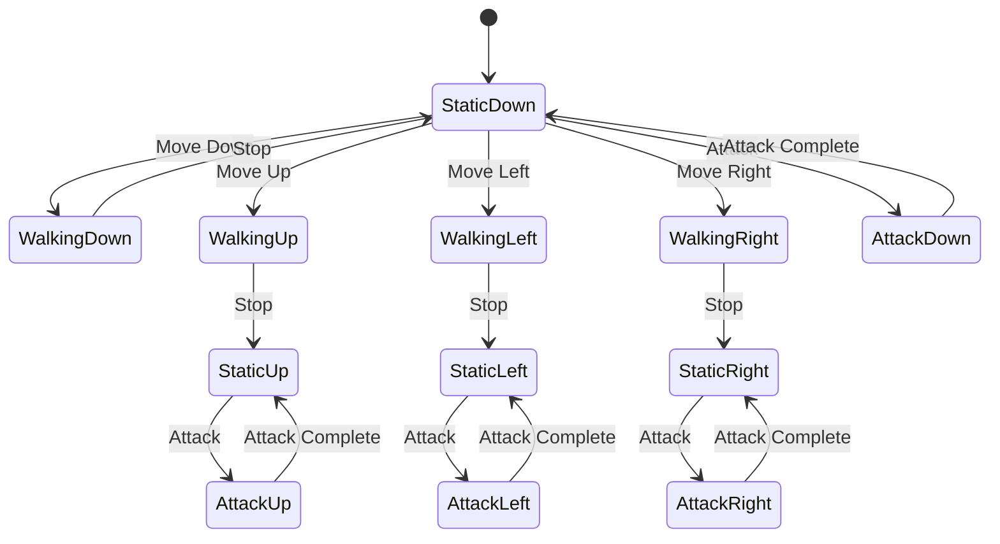

# Characters

Characters are the actors in your game world. They can be player-controlled protagonists, switchable crew mates, or non-player characters (NPCs) with autonomous behaviors.

## Table of Contents

- [Overview](#overview)
- [Creating a Character](#creating-a-character)
- [Configuration Fields](#configuration-fields)
- [Character Types](#character-types)
- [Directional Sprites](#directional-sprites)
- [NPC Behaviors](#npc-behaviors)
- [Best Practices](#best-practices)
- [Examples](#examples)

## Overview

**Post Type:** `explore-character`

Characters bring life to your game world. The system supports sophisticated character configuration including directional sprites, weapon-specific animations, special abilities, and complex AI behaviors for NPCs.

### Key Features

- Full directional sprite support (up, down, left, right)
- Weapon-specific character images for each direction
- Playable characters and crew mate system
- NPC autonomous behaviors (wandering, pathing)
- Text-to-speech voice assignment
- Materialization and removal systems
- Interaction with cutscenes and missions

## Creating a Character

1. Navigate to **Orbem Studio** → **Characters**
2. Click **Add New**
3. Enter a character name (this becomes the display name)
4. Configure meta fields in the Configuration box
5. Upload character images for all required directions
6. Click **Publish**

## Configuration Fields

### Basic Configuration

#### Area Placement

**Field:** `explore-area`  
**Type:** Select

The area where this character appears in the game world.

**Example:** Select "starting-village" to place the character in that area.

#### Position and Size

**Fields:**
- `explore-top` - Vertical position in pixels
- `explore-left` - Horizontal position in pixels
- `explore-height` - Character height in pixels
- `explore-width` - Character width in pixels

**Example:**
```
Top: 2000
Left: 2500
Height: 100
Width: 80
```

#### Visual Properties

**Field:** `explore-rotation`  
**Type:** Number  
**Unit:** Degrees

Rotate the character sprite (useful for angled starting poses).

**Field:** `explore-layer`  
**Type:** Number

Z-index for layering. Higher numbers appear in front of lower numbers.

**Example:**
```
Rotation: 0 (no rotation)
Layer: 5 (appears above objects with layer < 5)
```

### Character Name Override

**Field:** `explore-character-name`  
**Type:** Text

Display name shown to players. If empty, uses the post title.

**Use Cases:**
- Show formatted names with special characters
- Support multiple languages
- Display nicknames or aliases
- Keep backend titles clean while showing styled names

**Example:**
```
Post Title: hero-character-01
Character Name: "The Wandering Hero"
```

### Character Images

**Field:** `explore-character-images`  
**Type:** Multiple uploads (subfields)

The core visual representation of your character. You must upload images for all directions and states.

#### Required Images

**Static Poses (Standing Still):**
- `static-up` - Facing upward (away from camera)
- `static-down` - Facing downward (toward camera)
- `static-left` - Facing left
- `static-right` - Facing right

**Walking Animations:**
- `up` - Walking upward
- `down` - Walking downward
- `left` - Walking left
- `right` - Walking right

**Static Drag Poses (Optional - for carrying items):**
- `static-up-drag` - Standing still while carrying, facing up
- `static-left-drag` - Standing still while carrying, facing left
- `static-right-drag` - Standing still while carrying, facing right

**Dragging Animations (Optional):**
- `up-drag` - Walking while carrying, upward
- `left-drag` - Walking while carrying, left
- `right-drag` - Walking while carrying, right

**Combat Poses (for playable characters):**
- `up-punch` - Attacking upward
- `down-punch` - Attacking downward
- `left-punch` - Attacking left
- `right-punch` - Attacking right

#### Image Specifications

- **Format:** PNG (with transparency) or GIF (for animations)
- **Dimensions:** Consistent across all images (e.g., 80px × 100px)
- **Animation:** Use GIF for walking animations, PNG for static poses
- **Transparency:** Use alpha channel for non-rectangular sprites

**Tips:**
- Keep file sizes small for faster loading
- Use the same dimensions for all images to prevent scaling issues
- Test all animations in-game to verify smoothness
- Consider creating sprite sheets and slicing them for consistency

### Weapon-Specific Images

**Field:** `explore-weapon-images`  
**Type:** Multiple uploads (dynamic based on available weapons)

For playable characters, you can upload unique images for each weapon they can equip.

The field automatically generates upload slots for each weapon (except the default weapon) combined with each character pose:

**Example weapon-specific image fields:**
- `static-sword` - Standing still with sword
- `up-sword` - Walking up with sword
- `down-punch-sword` - Attacking down with sword
- `static-laser-gun` - Standing still with laser gun
- `left-punch-laser-gun` - Attacking left with laser gun

**How It Works:**
1. Plugin detects all weapons in your game
2. For each weapon (except default), creates image upload fields
3. Combines weapon names with character poses

**Note:** Only required for playable characters. NPCs don't use weapon-specific images.

### Playable Character Settings

#### Crew Mate Status

**Field:** `explore-crew-mate`  
**Type:** Radio (`yes` or `no`)

Determines if this character can be controlled by the player.

- **Yes:** Character is playable (can be main character or crew mate)
- **No:** Character is an NPC with autonomous behavior

**Example:**
```
Crew Mate: yes (This is the main hero)
```

#### Special Ability

**Field:** `explore-ability`  
**Type:** Select

Assign a special ability to playable characters.

**Available Abilities:**
- `speed` - Increased movement speed
- `strength` - Increased attack power
- `hazard` - Can walk through hazardous areas
- `programming` - Can interact with technical objects

**Example:**
```
Ability: hazard (Can walk through toxic zones)
```

**Use Cases:**
- Gating areas behind specific abilities
- Creating puzzles that require ability switching
- Character specialization in party-based gameplay

#### Default Weapon

**Field:** `explore-weapon-choice`  
**Type:** Select (list of weapons)

The weapon this character starts with when first recruited or played.

**Example:**
```
Weapon Choice: energy-sword
```

### Voice Configuration

**Field:** `explore-voice`  
**Type:** Select (Google TTS voices)

Assign a text-to-speech voice for cutscene dialogue.

**Requirements:**
- Google TTS API key configured in [Global Options](../global-options.md)
- Voice selection from available Google voices

**Available Voice Types:**
- Male and female voices
- Multiple languages
- Different voice styles (standard, wavenet, neural)

**Example:**
```
Voice: en-US-Wavenet-D (Female voice)
```

See [Cutscenes](cutscenes.md) for how voices are used in dialogue.

### NPC Configuration

These settings control autonomous NPC behavior.

#### Movement Speed

**Field:** `explore-speed`  
**Type:** Number

How fast the NPC moves. Higher values = faster movement.

**Example:**
```
Speed: 2 (Moderate pace)
Speed: 5 (Fast movement)
Speed: 1 (Slow movement)
```

**Tips:**
- Match speed to character personality (elderly = slow, energetic = fast)
- Consider gameplay balance (fleeing NPCs, chase sequences)
- Test speeds in context of area size

#### Wanderer Mode

**Field:** `explore-wanderer`  
**Type:** Radio (`yes` or `no`)

Enable intelligent autonomous movement throughout the area.

- **Yes:** NPC automatically explores available walkable space
- **No:** NPC follows defined path or stays stationary

**Wanderer Behavior:**
- Intelligently navigates the area
- Avoids walls and boundaries
- Changes direction randomly
- Creates lifelike ambient movement

**Use Cases:**
- Villagers wandering in a town
- Animals roaming in a forest
- Guards on patrol

**Example:**
```
Wanderer: yes
Speed: 2
```

#### Walking Path

**Field:** `explore-path`  
**Type:** Repeater (multiple coordinate pairs)

Define a specific path the NPC follows.

**Structure:**
```
Point 1: Top: 2000, Left: 2500
Point 2: Top: 2000, Left: 3000
Point 3: Top: 2500, Left: 3000
Point 4: Top: 2500, Left: 2500
```

**Behavior:**
- NPC walks to each point in sequence
- Uses configured speed for movement
- Can optionally repeat after reaching the end

**Tips:**
- Use [Developer Mode](../developer-mode.md) to set path points visually
- Keep paths smooth with reasonable distances between points
- Test path timing to ensure NPC reaches destinations

#### Path Repeat

**Field:** `explore-repeat`  
**Type:** Radio (`yes` or `no`)

Control if the NPC repeats their walking path.

- **Yes:** Loop back to start after reaching the end
- **No:** Stop at the final point

**Example:**
```
Path: [4 points forming a square]
Repeat: yes
(NPC walks in a continuous square pattern)
```

#### Time Between Paths

**Field:** `explore-time-between`  
**Type:** Number  
**Unit:** Milliseconds

Pause duration at each path point before moving to the next.

**Example:**
```
Time Between: 2000 (2 second pause at each point)
Time Between: 0 (No pause, continuous movement)
```

**Use Cases:**
- Guard pausing to look around at patrol points
- NPC stopping to perform actions
- Creating more natural movement patterns

### Path Trigger

**Field:** `explore-path-trigger`  
**Type:** Complex object

Define a trigger zone that starts the NPC's movement path.

**Subfields:**
- `top` - Trigger top position
- `left` - Trigger left position
- `height` - Trigger height
- `width` - Trigger width
- `cutscene` - Cutscene that activates this path
- `item` - Item that activates this path

**Example Use Case:**
```
NPC stands still until player completes a cutscene,
then begins walking their defined path.

Path Trigger:
  Cutscene: welcome-dialogue
  (NPC starts moving after "welcome-dialogue" completes)
```

### Materialization System

Control when and how characters appear in the game world.

#### Materialize Trigger

**Field:** `explore-materialize-item-trigger`  
**Type:** Trigger zone

A physical zone that reveals this character when touched.

**Subfields:**
- `top` - Trigger top coordinate
- `left` - Trigger left coordinate
- `height` - Trigger height
- `width` - Trigger width

**Example:**
```
Character is hidden until player walks to a specific location,
then character materializes.

Materialize Trigger:
  Top: 3000
  Left: 3500
  Height: 100
  Width: 100
```

#### Materialize After Cutscene

**Field:** `explore-materialize-after-cutscene`  
**Type:** Select (list of cutscenes)

Character appears after a specific cutscene completes.

**Example:**
```
Materialize After Cutscene: rescue-scene
(Character appears after being rescued in cutscene)
```

#### Materialize After Mission

**Field:** `explore-materialize-after-mission`  
**Type:** Select (list of missions)

Character appears after a specific mission is completed.

**Example:**
```
Materialize After Mission: find-the-key
(NPC appears after player completes the mission)
```

#### Remove After Cutscene

**Field:** `explore-remove-after-cutscene`  
**Type:** Select (list of cutscenes)

Character disappears after a specific cutscene completes.

**Example:**
```
Remove After Cutscene: farewell-scene
(NPC leaves the game world after saying goodbye)
```

## Character Types

### Main Character

The primary player-controlled character.

**Configuration:**
```
Crew Mate: yes
Ability: (choose primary ability)
Weapon Choice: (starting weapon)
Voice: (for cutscene dialogue)

Required Images: All directional sprites + weapon variants
```

**Set as Main Character:**
Go to **Orbem Studio** → **Game Options** → **Main Character** and select this character.

### Crew Mate

Additional playable characters the player can collect and switch between.

**Configuration:**
```
Crew Mate: yes
Ability: (unique ability)
Weapon Choice: (default weapon)
Voice: (for cutscene dialogue)

Required Images: All directional sprites + weapon variants
```

**Recruitment:**
Use missions or cutscenes to add crew mates to the player's roster. See [API endpoints](../api/gameplay-endpoints.md#add-character) for programmatic recruitment.

### Static NPC

NPC that doesn't move, used for shopkeepers, quest givers, etc.

**Configuration:**
```
Crew Mate: no
Wanderer: no
Path: (empty)

Required Images: Static poses only (can skip walking animations)
```

**Use Cases:**
- Shopkeepers behind counters
- Statues or decorative characters
- Quest givers who never move

### Wandering NPC

NPC that roams freely throughout the area.

**Configuration:**
```
Crew Mate: no
Wanderer: yes
Speed: 2

Required Images: All directional sprites
```

**Use Cases:**
- Townspeople
- Animals
- Ambient life

### Pathing NPC

NPC that follows a predefined walking path.

**Configuration:**
```
Crew Mate: no
Wanderer: no
Path: [multiple points]
Repeat: yes
Speed: 2

Required Images: All directional sprites
```

**Use Cases:**
- Guards on patrol
- NPCs with routines
- Escort missions

## Directional Sprites

The character sprite system supports full 4-directional movement with multiple states.

### Sprite State Machine



### Image Naming Convention

Character images follow this pattern:
```
[state]-[direction]-[weapon]

Examples:
static-down          (Standing still, facing down, default weapon)
up                   (Walking up, default weapon)
down-punch-sword     (Attacking down with sword)
static-left-gun      (Standing left with gun)
```

### Creating Consistent Sprites

**Dimensions:**
- Use the same pixel dimensions for all images
- Common sizes: 64×64, 80×100, 100×120

**Orientation:**
- Down = facing toward screen/player
- Up = facing away from screen/player
- Left/Right = profile views

**Animation Frames:**
- GIFs can contain multiple frames for smooth animation
- Typical walking cycle: 4-8 frames
- Attack animations: 2-4 frames

**Transparency:**
- Use PNG alpha channel or GIF transparency
- Ensure background is fully transparent

## NPC Behaviors

### Wanderer Intelligence

When `explore-wanderer` is "yes", NPCs use pathfinding to explore the area.

**Algorithm:**
1. Check available directions (not blocked by walls)
2. Randomly select a direction
3. Move in that direction for a random duration
4. Repeat

**Tips:**
- Add walls to guide wanderer movement
- Set appropriate speed for area size
- Test with multiple wanderers to ensure they don't cluster

### Path Following

NPCs follow defined paths precisely.

**Best Practices:**
- Keep path segments short for smooth movement
- Add pause points (`explore-time-between`) at corners
- Test paths for collision with walls
- Consider looping vs. one-way paths

### Trigger-Based Movement

Use `explore-path-trigger` to start NPC movement conditionally.

**Scenarios:**
- NPC starts walking after player triggers a cutscene
- NPC begins patrol after player collects an item
- NPC flees when a mission is completed

## Best Practices

### Image Organization

**File Naming:**
```
hero-static-down.png
hero-walk-up.gif
hero-attack-left-sword.png
```

**Directory Structure:**
```
/characters/
  /hero/
    static-down.png
    static-up.png
    walk-down.gif
    ...
  /guard/
    static-down.png
    ...
```

### Performance Optimization

**File Sizes:**
- Compress images without visible quality loss
- Keep GIF frame counts reasonable (4-8 frames typically)
- Total character image set should be under 1MB

**Loading Strategy:**
- Load playable characters first
- Lazy-load NPC images
- Preload images for areas the player is moving toward

### Gameplay Design

**Character Differentiation:**
- Give each crew mate unique abilities
- Match abilities to puzzle design
- Create reasons to switch between characters

**NPC Personality:**
- Match movement speed to character personality
- Use wandering for casual NPCs, paths for intentional ones
- Position NPCs near relevant locations (shopkeeper near shop)

## Examples

### Example 1: Main Hero Character

```
Title: Main Hero
Slug: main-hero

Area: starting-village
Top: 2500
Left: 2750
Height: 100
Width: 80

Crew Mate: yes
Ability: strength
Weapon Choice: starter-sword
Voice: en-US-Wavenet-A

Images: All directional sprites + weapon variants uploaded
```

### Example 2: Wandering Villager

```
Title: Village Elder
Slug: village-elder

Area: starting-village
Top: 3000
Left: 3200
Height: 100
Width: 80

Crew Mate: no
Wanderer: yes
Speed: 1
Voice: en-US-Wavenet-C

Images: All directional sprites uploaded
```

### Example 3: Patrolling Guard

```
Title: Castle Guard
Slug: castle-guard

Area: castle-entrance
Top: 2000
Left: 2500
Height: 110
Width: 85

Crew Mate: no
Speed: 2
Path:
  Point 1: Top: 2000, Left: 2500
  Point 2: Top: 2000, Left: 3500
  Point 3: Top: 2500, Left: 3500
  Point 4: Top: 2500, Left: 2500
Repeat: yes
Time Between: 1500

Images: All directional sprites uploaded
```

### Example 4: Recruitable Crew Mate

```
Title: Tech Specialist
Slug: tech-specialist

Area: research-lab
Top: 1800
Left: 2200
Height: 95
Width: 78

Crew Mate: yes
Ability: programming
Weapon Choice: laser-pistol
Voice: en-US-Wavenet-D

Materialize After Mission: rescue-specialist

Images: All directional sprites + weapon variants uploaded
```

## Related Documentation

- **[Areas](areas.md)** - Where characters exist
- **[Weapons](weapons.md)** - What characters equip
- **[Cutscenes](cutscenes.md)** - Character interactions
- **[Missions](missions.md)** - Character recruitment
- **[Developer Mode](../developer-mode.md)** - Visual character positioning
