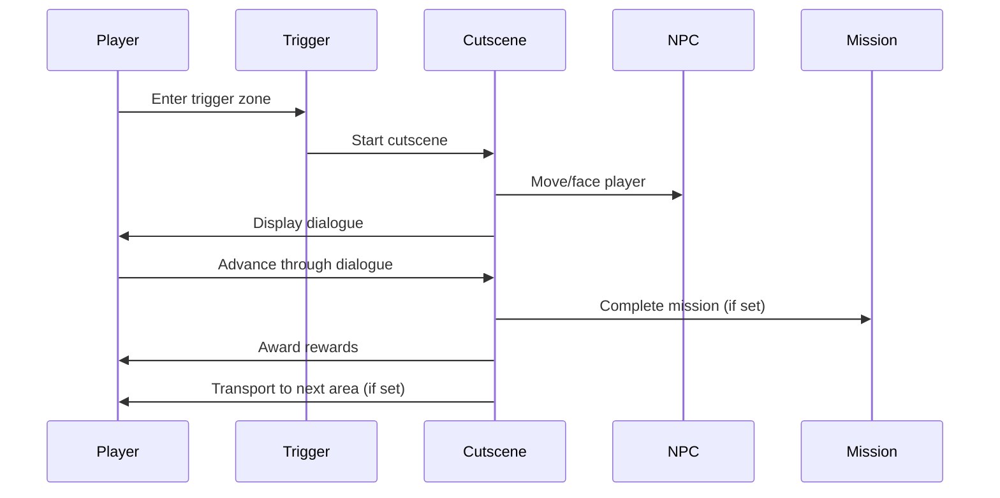

# Cutscenes

Cutscenes are scripted story sequences that deliver narrative, character dialogue, and dramatic moments. They support dialogue blocks, character movement, area transitions, and integration with missions.

## Overview

**Post Type:** `explore-cutscene`

Cutscenes provide storytelling through text/voice dialogue, character interactions, music, and visual sequences. They can be triggered automatically or by player interaction.

## Configuration Fields

### Basic Setup

- **Area** (`explore-area`): Where the cutscene trigger appears
- **Cutscene Trigger** (`explore-cutscene-trigger`): Trigger zone (top, left, height, width)
- **Trigger Type** (`explore-trigger-type`):
  - `auto` - Starts immediately when player touches trigger
  - `engagement` - Requires player to press action key while on trigger

### Content

**Post Content**: Use the WordPress block editor to add dialogue:
- **Orbem Paragraph MP3 block**: Dialogue with text-to-speech or uploaded soundbite
- **Video blocks**: Video cutscenes

### Audio

- **Cutscene Music** (`explore-cutscene-music`): Audio file that plays during cutscene
- **Mute Music** (`explore-mute-music`): Mute area music during cutscene (`yes`/`no`)

### Character Integration

- **Character** (`explore-character`): NPC involved in this cutscene
- **NPC Face Me** (`explore-npc-face-me`): NPC turns to face player (`yes`/`no`)
- **Character Position** (`explore-cutscene-character-position`): Where player moves (top, left)

### NPC Movement

**Move NPC** (`explore-cutscene-move-npc`):
- `before` - NPC moves before cutscene dialogue
- `after` - NPC moves after cutscene completes

**Path After Cutscene** (`explore-path-after-cutscene`):
- Repeater field with coordinate pairs
- NPC walks this path after cutscene

**Movement Speed** (`explore-speed`): NPC walking speed  
**Time Between** (`explore-time-between`): Pause at each path point

### Area Transitions

- **Next Area** (`explore-next-area`): Area to send player to after cutscene
- **Next Area Position** (`explore-cutscene-next-area-position`): Starting coordinates in next area (top, left)

### Rewards

- **Value** (`explore-value`): Reward amount
- **Value Type** (`explore-value-type`): Reward type (`point`, `mana`, `health`, `money`)
- **Communication** (`explore-engage-communicate`): Send message to player's communicator

### Mission Integration

- **Mission Trigger** (`explore-mission-cutscene`): Mission that triggers this cutscene
- **Mission Complete** (`explore-mission-complete-cutscene`): Mission completed by finishing cutscene

### Boss Integration

- **Cutscene Boss** (`explore-cutscene-boss`): Boss enemy that starts fighting after cutscene

### Materialization

- **Materialize Trigger** (`explore-materialize-item-trigger`): Physical trigger to reveal this cutscene
- **Remove After Cutscene** (`explore-remove-after-cutscene`): Remove this cutscene after another completes
- **Materialize After Cutscene** (`explore-materialize-after-cutscene`): Reveal after cutscene completes
- **Materialize After Mission** (`explore-materialize-after-mission`): Reveal after mission completes

## Cutscene Flow



## Text-to-Speech

Use the **Orbem Paragraph MP3** block for voiced dialogue:

1. Add the block in the cutscene content
2. Enter dialogue text
3. Character's assigned voice will narrate the text
4. Requires Google TTS API key in Global Options

## Examples

### Example 1: Simple Dialogue

```
Title: Welcome to Village
Area: starting-village

Cutscene Trigger:
  Top: 2500
  Left: 2750
  Height: 100
  Width: 100
Trigger Type: auto

Character: village-elder
NPC Face Me: yes

Content:
  "Welcome, traveler! We've been expecting you."
```

### Example 2: Mission Completion Cutscene

```
Title: Quest Complete
Area: forest-cave

Mission Complete: explore-cave

Value: 100
Value Type: point

Content:
  "You've discovered the ancient artifact!"
  
Next Area: village-square
```

### Example 3: Boss Fight Trigger

```
Title: Boss Awakens
Area: throne-room

Cutscene Trigger:
  Top: 1500
  Left: 2500
  Height: 150
  Width: 150
Trigger Type: auto

Cutscene Boss: shadow-lord

Content:
  "You dare challenge me?"
```

## Related Documentation

- **[Characters](characters.md)** - NPC interactions
- **[Missions](missions.md)** - Mission integration
- **[Enemies](enemies.md)** - Boss triggers
- **[Areas](areas.md)** - Area transitions
