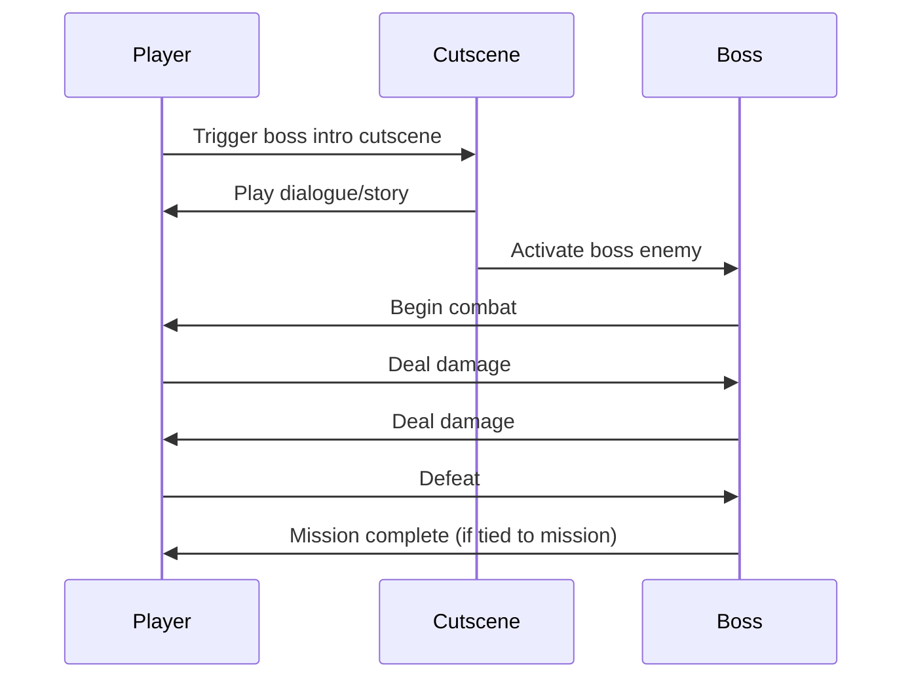

# Enemies

Enemies are hostile entities that challenge the player through combat. Orbem Studio supports four distinct enemy types with configurable AI behaviors, health, damage values, and movement patterns.

## Table of Contents

- [Overview](#overview)
- [Creating an Enemy](#creating-an-enemy)
- [Configuration Fields](#configuration-fields)
- [Enemy Types](#enemy-types)
- [Boss Fights](#boss-fights)
- [AI Behaviors](#ai-behaviors)
- [Best Practices](#best-practices)
- [Examples](#examples)

## Overview

**Post Type:** `explore-enemy`

Enemies provide challenge and combat scenarios in your game. They share many configuration options with characters but include combat-specific settings like damage values, health points, and enemy-specific behaviors.

### Key Features

- Four enemy types: blocker, shooter, runner, boss
- Configurable health and damage values
- Movement AI (wandering, pathing, static)
- Directional sprite support
- Integration with missions (defeat to complete quest)
- Materialization system (appear after conditions met)
- Text-to-speech voice support

## Creating an Enemy

1. Navigate to **Orbem Studio** → **Enemies**
2. Click **Add New**
3. Enter an enemy name (e.g., "Forest Wolf" or "Rogue Robot")
4. Configure meta fields in the Configuration box
5. Upload enemy images for all directions
6. Click **Publish**

## Configuration Fields

### Basic Configuration

#### Area Placement

**Field:** `explore-area`  
**Type:** Select

The area where this enemy appears.

**Example:** Select "dark-forest" to place the enemy in that area.

#### Position and Size

**Fields:**
- `explore-top` - Vertical position in pixels
- `explore-left` - Horizontal position in pixels
- `explore-height` - Enemy height in pixels
- `explore-width` - Enemy width in pixels

**Example:**
```
Top: 1800
Left: 2200
Height: 120
Width: 100
```

**Tips:**
- Larger enemies feel more threatening
- Position away from player start points
- Consider sight lines and surprise factor

#### Visual Properties

**Field:** `explore-rotation`  
**Type:** Number  
**Unit:** Degrees

Rotate the enemy sprite.

**Field:** `explore-layer`  
**Type:** Number

Z-index for layering. Higher numbers appear in front.

**Example:**
```
Rotation: 0
Layer: 5
```

### Enemy Name Override

**Field:** `explore-character-name`  
**Type:** Text

Display name shown to players during combat or interactions.

**Example:**
```
Post Title: wolf-enemy-01
Character Name: "Corrupted Wolf"
```

### Enemy Images

**Field:** `explore-character-images`  
**Type:** Multiple uploads

Visual representation of the enemy. Same directional sprite system as characters.

**Required Images:**
- `static-up` - Facing upward
- `static-down` - Facing downward
- `static-left` - Facing left
- `static-right` - Facing right
- `up` - Moving upward
- `down` - Moving downward
- `left` - Moving left
- `right` - Moving right

**Optional Attack Poses:**
- `up-punch` - Attacking upward
- `down-punch` - Attacking downward
- `left-punch` - Attacking left
- `right-punch` - Attacking right

**Specifications:**
- **Format:** PNG (with transparency) or GIF (for animations)
- **Dimensions:** Consistent across all images
- **Style:** Match character art style

### Enemy Type

**Field:** `explore-enemy-type`  
**Type:** Select

Determines the enemy's behavior and combat style.

**Options:**
- `blocker` - Static enemy, no special abilities
- `shooter` - Fires projectiles at the player
- `runner` - Chases and collides with the player
- `boss` - Special boss fight mechanics

**Example:**
```
Enemy Type: shooter
```

See [Enemy Types](#enemy-types) section for detailed behavior descriptions.

### Combat Stats

#### Damage Value

**Field:** `explore-value`  
**Type:** Number

How much damage this enemy deals to the player.

**Example:**
```
Value: 10 (Low damage)
Value: 25 (Medium damage)
Value: 50 (High damage)
```

**Balance Considerations:**
- Compare to player health pool
- Consider enemy frequency in area
- Balance with weapon damage for combat duration

#### Health

**Field:** `explore-health`  
**Type:** Number

How much damage the enemy can take before being defeated.

**Example:**
```
Health: 50 (Weak enemy)
Health: 100 (Standard enemy)
Health: 500 (Boss enemy)
```

**Tips:**
- Higher health = longer combat encounters
- Match health to enemy importance
- Boss enemies should have significantly more health

### Movement Configuration

Enemies use the same movement system as NPCs.

#### Movement Speed

**Field:** `explore-speed`  
**Type:** Number

How fast the enemy moves.

**Example:**
```
Speed: 1 (Slow, heavily armored)
Speed: 3 (Medium speed)
Speed: 5 (Fast, aggressive)
```

**Gameplay Impact:**
- Fast enemies are harder to avoid
- Slow enemies allow strategic positioning
- Match speed to enemy type (runner = fast, blocker = slow)

#### Wanderer Mode

**Field:** `explore-wanderer`  
**Type:** Radio (`yes` or `no`)

Enable autonomous area exploration.

**Behavior:**
- **Yes:** Enemy roams freely, creating dynamic encounters
- **No:** Enemy follows defined path or stays stationary

**Use Cases:**
- Wandering: Patrol enemies, roaming creatures
- Static: Guard enemies, trap encounters

#### Walking Path

**Field:** `explore-path`  
**Type:** Repeater (coordinate pairs)

Define a specific patrol route.

**Example:**
```
Point 1: Top: 2000, Left: 2500
Point 2: Top: 2000, Left: 3500
Point 3: Top: 2500, Left: 3500
Point 4: Top: 2500, Left: 2500
```

**Strategy:**
- Create patrol patterns players must navigate around
- Design paths that block important locations
- Consider timing and spacing for player dodging

#### Path Repeat

**Field:** `explore-repeat`  
**Type:** Radio (`yes` or `no`)

Control if the enemy repeats their patrol path.

**Example:**
```
Repeat: yes (Continuous patrol)
Repeat: no (One-way patrol, stops at end)
```

#### Time Between Points

**Field:** `explore-time-between`  
**Type:** Number  
**Unit:** Milliseconds

Pause duration at each path point.

**Example:**
```
Time Between: 2000 (2 second pause)
```

**Tactical Use:**
- Brief pauses at corners (realistic patrol)
- Long pauses create windows for players to pass

### Voice Configuration

**Field:** `explore-voice`  
**Type:** Select (Google TTS voices)

Assign a voice for enemy dialogue or taunts in cutscenes.

**Requirements:**
- Google TTS API key in Global Options
- Typically used for boss enemies with dialogue

**Example:**
```
Voice: en-US-Wavenet-B (Menacing male voice)
```

### Materialization System

Control when enemies appear in the game world.

#### Materialize After Cutscene

**Field:** `explore-materialize-after-cutscene`  
**Type:** Select (list of cutscenes)

Enemy appears after a specific cutscene completes.

**Example:**
```
Materialize After Cutscene: alarm-triggered
(Enemies appear after alarm cutscene)
```

#### Materialize After Mission

**Field:** `explore-materialize-after-mission`  
**Type:** Select (list of missions)

Enemy appears after a specific mission is completed.

**Example:**
```
Materialize After Mission: open-the-gate
(Enemy appears after gate opens)
```

#### Remove After Cutscene

**Field:** `explore-remove-after-cutscene`  
**Type:** Select (list of cutscenes)

Enemy disappears after a cutscene.

**Example:**
```
Remove After Cutscene: peace-treaty
(Enemy leaves after story resolution)
```

## Enemy Types

### Blocker

**Type:** `blocker`

Static or patrolling enemies with no special abilities. Engage in melee combat when player approaches.

**Behavior:**
- Follows path or wanders (based on configuration)
- Attacks when player is in range
- Basic combat AI
- No projectile attacks

**Best For:**
- Guard enemies
- Obstacles that require combat to pass
- Low-level encounters

**Example Configuration:**
```
Enemy Type: blocker
Value: 10
Health: 75
Speed: 2
Wanderer: no
Path: [Guard post patrol pattern]
```

### Shooter

**Type:** `shooter`

Ranged enemies that fire projectiles at the player.

**Behavior:**
- Maintains distance from player
- Fires projectiles periodically
- Can move while shooting
- Projectile damage uses `explore-value`

**Best For:**
- Ranged combat challenges
- Tower defense scenarios
- Forcing player movement

**Tactical Considerations:**
- Place in elevated positions or behind barriers
- Combine with blocker enemies for layered difficulty
- Projectile speed and damage balance is key

**Example Configuration:**
```
Enemy Type: shooter
Value: 15
Health: 60
Speed: 1
Wanderer: no
(Shooter AI automatically handles projectile firing)
```

### Runner

**Type:** `runner`

Aggressive enemies that chase the player and deal damage on collision.

**Behavior:**
- Actively pursues the player
- Deals damage when colliding with player
- Fast movement speed
- High aggression range

**Best For:**
- Chase sequences
- Creating pressure and urgency
- Forcing players to keep moving

**Gameplay Impact:**
- High speed makes them hard to escape
- Encourage dodging over direct combat
- Excellent for creating tension

**Example Configuration:**
```
Enemy Type: runner
Value: 20
Health: 40
Speed: 5
Wanderer: yes
(Runner AI automatically chases player when in range)
```

### Boss

**Type:** `boss`

Special enemies with boss fight mechanics, typically triggered by cutscenes.

**Behavior:**
- Must be triggered by a cutscene (see `explore-cutscene-boss`)
- Support for multi-phase fights
- Higher health pools
- Often combined with projectile or chase mechanics

**Best For:**
- End-of-level encounters
- Major story battles
- Gating progression

**Boss Fight Setup:**
1. Create boss enemy with type "boss"
2. Create cutscene that triggers the boss
3. Set cutscene's `explore-cutscene-boss` field to this boss
4. Player completes cutscene, boss fight begins

**Example Configuration:**
```
Enemy Type: boss
Value: 30
Health: 500
Speed: 3
Voice: en-US-Wavenet-B

(Triggered by cutscene: "boss-intro")
```

See [Boss Fights](#boss-fights) section for detailed setup.

## Boss Fights

Boss fights are special encounters triggered by cutscenes.

### Boss Fight Flow



### Setting Up a Boss Fight

#### Step 1: Create the Boss Enemy

```
Title: Shadow Lord
Enemy Type: boss
Value: 35
Health: 800
Speed: 3
Voice: en-US-Wavenet-B (for boss dialogue)

Area: throne-room
Top: 1500
Left: 2500
Height: 150
Width: 120
```

#### Step 2: Create Boss Intro Cutscene

```
Title: Shadow Lord Confrontation
Area: throne-room

Cutscene Trigger: (Position near throne)
Trigger Type: auto

Cutscene Boss: shadow-lord (select the boss enemy)

(Add dialogue content in the post content area)
```

#### Step 3: Optional Mission Integration

Link a mission to the boss:

```
Mission Title: Defeat the Shadow Lord
Trigger Enemy: shadow-lord
(Mission completes when boss is defeated)
```

### Boss Fight Phases

For multi-phase boss fights:

1. Create multiple boss enemies with different stats
2. Use cutscenes between phases
3. Remove defeated phase, materialize next phase
4. Each phase can have different behavior types

**Example Multi-Phase Boss:**
```
Phase 1: shadow-lord-phase-1 (Type: blocker)
Phase 2: shadow-lord-phase-2 (Type: shooter)
Phase 3: shadow-lord-phase-3 (Type: runner)
```

## AI Behaviors

### Static Enemies

No movement configuration needed.

**Setup:**
```
Wanderer: no
Path: (empty)
```

**Use Cases:**
- Turrets
- Trapped enemies
- Guard posts

### Patrol Enemies

Follow defined paths.

**Setup:**
```
Wanderer: no
Path: [multiple points]
Repeat: yes
Speed: 2
```

**Strategy:**
- Create predictable patterns players can learn
- Add brief pauses for realism
- Position patrols to block important paths

### Roaming Enemies

Wander freely throughout the area.

**Setup:**
```
Wanderer: yes
Path: (empty)
Speed: 2
```

**Gameplay:**
- Unpredictable encounters
- Dynamic difficulty
- Requires player awareness

### Aggressive Chase

For runner-type enemies that actively pursue the player.

**Setup:**
```
Enemy Type: runner
Wanderer: yes
Speed: 5
```

**Behavior:**
- Detects player within aggro range
- Chases until player escapes or enemy is defeated
- Creates high-pressure situations

## Best Practices

### Balance and Difficulty

**Health Pool Ratios:**
```
Early game: 50-100 health
Mid game: 100-200 health
Late game: 200-400 health
Boss: 500+ health
```

**Damage Balance:**
```
Player health: 100 (typical)
Weak enemy damage: 5-10
Standard enemy damage: 15-25
Boss damage: 30-50
```

**Combat Duration:**
- Weak enemies: 2-4 hits to defeat
- Standard enemies: 5-10 hits
- Bosses: 15-30 hits

### Enemy Placement

**Density:**
- Don't overwhelm players with too many enemies
- Leave safe spaces for players to recover
- Scale enemy count with area size

**Positioning:**
- Place enemies guarding valuable items
- Use line-of-sight to create surprise encounters
- Position shooters behind blockers

**Variety:**
- Mix enemy types in same area
- Combine static and mobile enemies
- Force players to adapt strategies

### Visual Design

**Sprite Clarity:**
- Enemies should be visually distinct from friendly NPCs
- Use color schemes that indicate threat (red, dark colors)
- Make boss enemies noticeably larger

**Animation:**
- Attack animations should clearly telegraph damage
- Movement animations should indicate speed
- Death animations provide satisfying feedback

### Performance

**Optimization:**
- Limit active enemies in player's vicinity
- Despawn enemies far from player
- Use sprite sheets for efficient loading

## Examples

### Example 1: Basic Guard Enemy

```
Title: Castle Guard
Slug: castle-guard-enemy

Enemy Type: blocker
Area: castle-entrance
Top: 2000
Left: 2500
Height: 110
Width: 90

Value: 15
Health: 100
Speed: 2

Path:
  Point 1: Top: 2000, Left: 2500
  Point 2: Top: 2000, Left: 3500
Repeat: yes
Time Between: 3000
```

### Example 2: Aggressive Runner

```
Title: Shadow Beast
Slug: shadow-beast

Enemy Type: runner
Area: dark-forest
Top: 1500
Left: 1800
Height: 130
Width: 110

Value: 25
Health: 80
Speed: 5

Wanderer: yes
```

### Example 3: Ranged Shooter

```
Title: Turret Drone
Slug: turret-drone

Enemy Type: shooter
Area: security-zone
Top: 2200
Left: 3000
Height: 100
Width: 100

Value: 20
Health: 150
Speed: 0

Wanderer: no
Path: (empty - stays stationary)
```

### Example 4: Multi-Phase Boss

```
Phase 1:
Title: Dragon Lord - Phase 1
Enemy Type: blocker
Value: 30
Health: 400
Speed: 2

Phase 2 (materializes after Phase 1 defeated):
Title: Dragon Lord - Phase 2
Enemy Type: shooter
Value: 35
Health: 400
Speed: 3
Materialize After Mission: defeat-dragon-phase-1

Phase 3:
Title: Dragon Lord - Final Form
Enemy Type: runner
Value: 40
Health: 500
Speed: 4
Materialize After Mission: defeat-dragon-phase-2
```

## Related Documentation

- **[Characters](characters.md)** - Shared configuration with enemies
- **[Weapons](weapons.md)** - Combat system
- **[Missions](missions.md)** - Enemy defeat objectives
- **[Cutscenes](cutscenes.md)** - Boss fight triggers
- **[Developer Mode](../developer-mode.md)** - Visual enemy positioning
