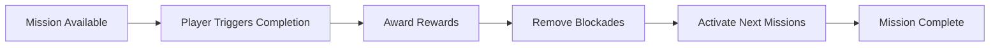

# Missions

Missions (also called quests or objectives) provide structure and goals for players. They support branching quest chains, multiple completion conditions, rewards, and progression gating.

## Overview

**Post Type:** `explore-mission`

Missions drive player progression through objectives, rewards, and unlockable content. They can be completed through various methods including reaching locations, defeating enemies, or interacting with items.

## Configuration Fields

### Basic Setup

- **Area** (`explore-area`): Where this mission is active
- **Reward Value** (`explore-value`): Amount of reward points
- **Reward Type** (`explore-value-type`): Type of reward (`point`, `mana`, `health`, `money`)

### Completion Triggers

**Location Trigger** (`explore-mission-trigger`):
- Trigger zone (top, left, height, width)
- Player completes mission by entering this zone

**Item Triggers** (`explore-trigger-item`):
- Select one or more items (multiselect)
- Mission completes when player interacts with all selected items

**Enemy Trigger** (`explore-trigger-enemy`):
- Select specific enemy
- Mission completes when enemy is defeated

### Mission Rewards

**Points/Currency**:
```
Value: 100
Value Type: point
```

**Abilities** (`explore-ability`):
- Currently supports `transportation` ability
- Unlocks special player capabilities

### Mission Chains

**Next Missions** (`explore-next-mission`):
- Select one or more missions (multiselect)
- Selected missions become available after this mission completes
- Create branching or linear quest chains

### Blockades

**Mission Blockade** (top, left, height, width):
- Invisible wall that disappears when mission completes
- Gates areas or content behind mission completion

**Hazard Removal** (`explore-hazard-remove`):
- Select a hazard item
- Hazard is removed when mission completes

## Mission Flow



## Examples

### Example 1: Reach Location Mission

```
Title: Explore the Cave
Area: forest-area

Mission Trigger:
  Top: 1500
  Left: 2000
  Height: 150
  Width: 150

Value: 50
Value Type: point

Next Mission: defeat-cave-boss
```

### Example 2: Defeat Enemy Mission

```
Title: Defeat the Guardian
Area: temple-entrance

Trigger Enemy: temple-guardian

Value: 100
Value Type: point

Blockade (gates temple interior):
  Top: 1800
  Left: 2500
  Height: 200
  Width: 100
```

### Example 3: Collect Items Mission

```
Title: Find Three Keys
Area: castle-grounds

Trigger Item:
  - golden-key
  - silver-key
  - bronze-key

Value: 75
Value Type: point

Next Mission:
  - unlock-castle-gate
```

## Related Documentation

- **[Cutscenes](cutscenes.md)** - Story sequences
- **[Enemies](enemies.md)** - Enemy defeat triggers
- **[Items](items-and-triggers.md)** - Item triggers
