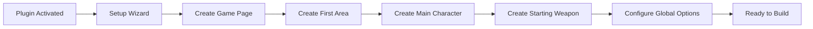

# Getting Started with Orbem Studio

This guide will walk you through installing Orbem Studio, completing the initial setup, and creating your first playable game area.

## Table of Contents

- [Installation](#installation)
- [Initial Setup Wizard](#initial-setup-wizard)
- [Creating Your First Area](#creating-your-first-area)
- [Creating Your First Character](#creating-your-first-character)
- [Configuring Global Game Options](#configuring-global-game-options)
- [Testing Your Game](#testing-your-game)
- [Next Steps](#next-steps)

## Installation

### From WordPress Plugin Directory

1. Log in to your WordPress admin dashboard
2. Navigate to **Plugins** → **Add New**
3. Search for "Orbem Studio"
4. Click **Install Now** on the Orbem Studio plugin
5. Click **Activate** once installation completes

### Manual Installation

1. Download the `orbem-studio` plugin folder
2. Upload the folder to `/wp-content/plugins/` on your server
3. Navigate to **Plugins** in your WordPress admin
4. Find "Orbem Studio" and click **Activate**

### Requirements Check

After activation, Orbem Studio will verify your server meets the minimum requirements:

- **PHP 8.1 or higher** - The plugin will display an admin notice if your PHP version is too old
- **WordPress 6.1 or higher** - Required for modern block editor features

## Initial Setup Wizard

Upon first activation, Orbem Studio will trigger a setup wizard to help you configure essential settings.

### Setup Flow



The setup wizard will guide you through:

1. Creating a dedicated page for your game
2. Setting up your first area/level
3. Creating your main character
4. Selecting a default weapon
5. Configuring essential game options

You can access the setup wizard anytime from **Orbem Studio** → **Game Options** in your WordPress admin.

## Creating Your First Area

Areas are the levels or maps where your game takes place. Each area has its own background image, music, and collection of game objects.

### Step-by-Step Area Creation

1. In your WordPress admin, navigate to **Orbem Studio** → **Areas**
2. Click **Add New**
3. Enter a title for your area (e.g., "Starting Zone" or "Level 1")

### Essential Area Configuration

In the Configuration meta box, set the following fields:

#### Map Image

Upload a large background image that serves as the playable area. This is where your character will walk.

- **Recommended size:** 5000px × 4517px minimum
- **Format:** PNG or JPG
- **Field:** "The area your characters will walk on"

**Tip:** Larger images provide more exploration space, but may impact load times. Optimize images for web before uploading.

#### Background Music (Optional)

Upload an audio file to play continuously while in this area.

- **Format:** MP3, WAV, or OGG
- **Field:** "The music that will play in the background of this area"

#### Starting Position

Set where the player character appears when entering this area:

- **Top coordinate:** Vertical position in pixels from the top edge
- **Left coordinate:** Horizontal position in pixels from the left edge
- **Starting direction:** Which way the character faces (`up`, `down`, `left`, `right`)

**Example values for center positioning:**
```
Top: 2000
Left: 2500
Direction: down
```

#### Area Transitions (Optional)

To connect this area to others, configure an area trigger:

- **Area:** Select the destination area
- **Trigger coordinates:** Position and size of the transition zone
- When the player touches this zone, they'll be transported to the selected area

### Publishing Your Area

Click **Publish** to make your area available in the game. You can create as many areas as you need for your game world.

## Creating Your First Character

Characters can be playable (controlled by the player) or NPCs (non-player characters with pre-defined behaviors).

### Creating a Playable Character

1. Navigate to **Orbem Studio** → **Characters**
2. Click **Add New**
3. Enter a character name (e.g., "Hero" or "Alex")

### Character Configuration

#### Character Images

Orbem Studio supports directional character sprites with multiple states. At minimum, you need:

**Static Poses:**
- `static-up` - Facing upward
- `static-down` - Facing downward
- `static-left` - Facing left
- `static-right` - Facing right

**Walking Animations:**
- `up` - Walking upward animation
- `down` - Walking downward animation
- `left` - Walking left animation
- `right` - Walking right animation

**Combat Poses (Optional):**
- `up-punch` - Attacking upward
- `down-punch` - Attacking downward
- `left-punch` - Attacking left
- `right-punch` - Attacking right

**Tip:** Use GIF files for walking animations, or PNG files for static poses. All images should be the same dimensions for consistent appearance.

#### Character Position

Place your character in an area:

- **Area:** Select which area this character appears in
- **Top/Left:** Position coordinates
- **Height/Width:** Character size in pixels

**Example character size:**
```
Height: 100
Width: 80
```

#### Playable Character Options

For characters the player can control:

- **Crew Mate:** Set to "yes" if this is a playable character
- **Ability:** Choose a special ability (`speed`, `strength`, `hazard`, `programming`)
- **Weapon Choice:** Select the default weapon for this character
- **Voice:** Choose a text-to-speech voice for cutscenes (requires Google TTS API key)

#### Character Name Override

The "Character Name" field allows you to set a display name different from the post title. This is useful for:

- Using clean post slugs in the backend while showing formatted names in-game
- Supporting multiple languages or character nicknames

### Publishing Your Character

Click **Publish** to add your character to the game world.

## Configuring Global Game Options

Global options control game-wide settings that affect all areas, characters, and gameplay systems.

### Accessing Global Options

Navigate to **Orbem Studio** → **Game Options** in your WordPress admin.

### Essential Settings

#### Page for Game

Select which WordPress page will display your game. This page will be replaced with the game interface when viewed by users.

1. Create a new page (e.g., "Play Game")
2. Publish the page (remove any content to avoid conflicts with game assets)
3. Select this page in the "Page For Game" option

#### Starting Area

Choose which area players begin in when they first load the game. This can be your tutorial or introductory level.

#### Main Character

Select which character the player controls at game start. This must be a character. This character must not have an Area, Top or Left fields filled out. Those fields are not needed for your main character.

#### Default Weapon

Choose the starting weapon for your main character. Many games use "fist" or "unarmed" as the default. Note, weapons are not required. This is more important if you plan on having multiple types of weapons.

#### Require Login

Choose whether players must create an account to play:

- **Checked:** Players must log in (game progress is saved)
- **Unchecked:** Anyone can play (progress is not persisted for logged-out users. Note: GAMES WITH MULTIPLE AREAS REQUIRE LOGIN)

### HUD Customization

The HUD (Heads-Up Display) shows player stats and controls during gameplay.

#### HUD Bars

Choose which stat bars to display:

- `health` - Player health points
- `mana` - Magic or energy points
- `power` - Special ability meter
- `money` - In-game currency
- `points` - Experience or score

Select only the stats relevant to your game design.

#### Custom Icons (Optional)

Override default HUD icons:

- **Settings Icon** - Gear menu icon
- **Storage Menu Icon** - Inventory icon
- **Crewmate Menu Icon** - Character switcher icon
- **Money Icon** - Currency symbol
- **Indicator Icon** - Interaction prompt icon

### External Integrations (Optional)

#### Google Login (OAuth)

To enable Google Sign-In:

1. Create a Google Cloud project
2. Set up OAuth 2.0 credentials
3. Add your Client ID to the "Google Login ClientID" field

#### Google Text-to-Speech

To enable voice acting for cutscenes and dialogue:

1. Enable the Google Cloud Text-to-Speech API
2. Generate an API key
3. Add the key to the "Google TTS API Key" field

**Note:** These integrations send data to Google's services. See the plugin's privacy policy for details.

### Saving Options

Click **Save Changes** at the bottom of the page to apply your configuration.

## Testing Your Game

Once you've created an area, and character, and configured global options, you're ready to test your game.

### Accessing Your Game

1. Navigate to the page you selected as "Page For Game" in global options
2. The game interface will load with your starting area
3. If "Require Login" is enabled, you'll see a login screen first

### Basic Controls

Default game controls:

- **Arrow Keys or WASD** - Move your character
- **Space Bar** - Interact with objects, NPCs, and triggers
- **Mouse Click** - UI interactions (inventory, menus)

### What to Test

1. **Movement** - Can your character walk around the area?
2. **Boundaries** - Does your character stay within the map?
3. **Starting Position** - Does your character appear in the correct location?

### Troubleshooting

**Character doesn't appear:**
- Verify the character's "Area" field is empty
- Check that the character's "Left" and "Top" fields are empty
- Ensure the starting area's starting position coordinates are within the map bounds

**Game page is blank:**
- Check browser console for JavaScript errors
- Verify the page is the correct page you selected in the game options
- Confirm the character has all required directional images uploaded

**Character falls through the map:**
- Ensure the map image is properly uploaded
- Check that map dimensions are large enough for the character's starting position

## Next Steps

Congratulations! You've created the foundation of your game. Here's what to explore next:

### Add Gameplay Elements

- **[Create missions](game-objects/missions.md)** - Give players objectives and rewards
- **[Add cutscenes](game-objects/cutscenes.md)** - Tell your story through dialogue
- **[Place enemies](game-objects/enemies.md)** - Add challenge and combat
- **[Create collectibles](game-objects/items-and-triggers.md)** - Hide items for players to find

### Use Developer Mode

- **[Enable Developer Mode](developer-mode.md)** - Visually position objects in-game
- Learn to use the wall builder for collision boundaries

### Customize Your Game

- **[Configure HUD styling](global-options.md#hud-customization)** - Match your game's aesthetic
- Set up cutscene border styles and colors
- Add custom music and sound effects

### Build Your World

- Create multiple connected areas for exploration
- Design branching mission chains
- Implement crew mate characters for party-based gameplay
- Add mini-games and interactive elements

### Advanced Topics

- **[Understand the REST API](api/README.md)** - For custom integrations
- **[Learn about hooks and filters](extending/hooks-and-filters.md)** - Extend functionality
- **[Build custom frontends](extending/custom-integrations.md)** - Create unique interfaces

---

**Need help?** Check out the other documentation sections or visit [https://orbem.studio/](https://orbem.studio/) for support resources.
